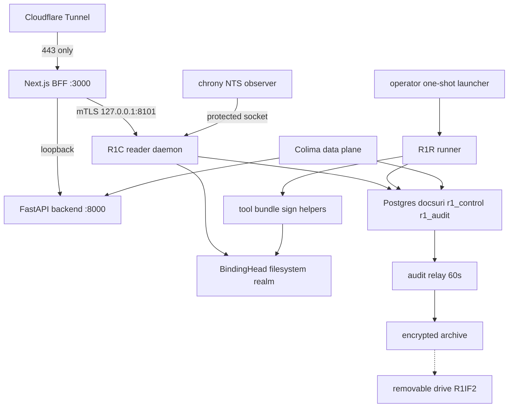

# REM-1 — Deployment Architecture

**단계**: CONSTRUCTION / Infrastructure Design
**유닛**: REM-1 Platform Integrity
**상태**: 작성·검증 완료 (2026-09-22)
**Companion**: `infrastructure-design.md`, `../../shared-infrastructure.md`
**제약**: C-14(무비용·Mac mini에서 전부 서빙), R1IF1=B(Colima 전환), R1IF2=A(이동식 드라이브 backup)

## 1. 단일 Mac 환경과 비용 경계

- 모든 application/API/worker/inference/검증 실행은 이 Mac mini에서 수행한다. 원격 VM/managed service/유료 CI/license의 자동 인계는 없다.
- 외부 보조 경계: 기존 무료 Cloudflare Tunnel(ingress relay), time.cloudflare.com NTS(무료), Healthchecks Hobbyist(무료 한도)—모두 무료 계층의 허용 범위 안인지 설치 시 확인한다. 시험 종료/free 한도 초과 시 paid로 자동 전환하지 않는다.
- 새 장비 구매, Apple Developer 프로그램, Docker Desktop/Docker Hub 유료 기능은 해가 아니다.

## 2. 토폴로지

텍스트 대안: 공개 요청은 무료 Cloudflare Tunnel을 통해 Next.js BFF(3000)로만 들어온다. BFF가 기존 FastAPI backend(8000)와 신규 R1C reader daemon(loopback 8101, mTLS)을 호출한다. R1C는 local Postgres의 r1_control/r1_audit schema와 filesystem BindingHead realm을 읽는다. 쓰기 경로는 operator가 부른 one-shot launcher가 supervisor/helper를 전용 UID로 실행하고, 도구는 offline/tool UID로 staging만 쓴다. 별도 chrony NTS observer가 보호된 채널로 clock health를 공급하고, 60초 audit relay가 암호화 archive를 이동식 드라이브로 전달한다. Colima data plane(OpenSearch/Redis/MinIO/ElasticMQ 등)은 기존 backend가 loopback으로 사용한다.

## 3. Boot/Unlock과 의존 준비 순서

| 순서 | 단계                                                                   | 미충족 시                                         |
| ---- | ---------------------------------------------------------------------- | ------------------------------------------------- |
| 1    | operator preboot console unlock(FileVault 인증)                        | host 미기동; 이는 operator 회복 절차의 시작점이다 |
| 2    | launchd 준비: chrony observer UID, custom keychain mount/접근 ACL      | R1C/helper가 clock/key unavailable를 표시         |
| 3    | Colima data plane 기동 및 의존 health                                  | backend/R1C가 bounded unready                     |
| 4    | R1C LaunchDaemon 기동 -> mTLS identity -> control/evidence 준비 재확인 | read까지 거부 또는 저하                           |
| 5    | operator-triggered 한정 helper/relay/backup만 명시 구동                | privileged 자동 재개 없음                         |

기존 GUI 세션 의존 정책(자동 로그인 등)은 cold boot 복구 인수로 패기한다: `infrastructure-design.md` §7처럼 FileVault preboot unlock과 키 준비를 절차에 통합하고, 재부팅 후 무인 자동 복구를 당연하게 가정하지 않는다.

## 4. Packaging/Provision

- root-managed release root에 frozen wheel/Node closure를 놓고 launchd plist(`/Library/LaunchDaemons/docsuri-r1c.plist` 등)와 제한 sudoers allowlist를 설치한다. runtime role은 release read-only다.
- 설치 도구는 UID 할당, keychain 생성, DB role/migration, CA 발급, pg_hba/hostssl, 포트 8101 충돌 검사를 수행하고 사전 상태를 기록한다. 실행 전 operator fact(`BACKUP_DRIVE` 등)와 free space/FV 상태를 다시 확인한다.

## 5. 전환(단계별) 및 롤백

### P0 — 보안/Backup 전제

1. 이동식 드라이브(R1IF2=A)에 검증된 backup/restore가 없는 변경을 시작하지 않는다.
2. 파일/로그 정리와 기존 아카이브 이동으로 data volume free space 확보.
3. FileVault 켜기('Off' 관측 해소) + preboot unlock 절차 검증.

롤백: FileVault는 항상 data를 보호한다; backup/드라이브 절차 자체는 되돌릴 필요가 없다.

### P1 — Colima 전환

1. Colima 설치·검증, Docker Engine 동작 확인(MIT, macOS arm64). Colima/Lima 공식 문서의 설치·운영 요건을 다시 확인한다.
2. 기존 Postgres `pg_dump`/OpenSearch snapshot을 호스트 바인드 경로로 export하고 검증한다. MinIO는 host bind mount이므로 그대로 쓴다. ElasticMQ는 현재 무볼륨(큐 상태는 운영 데이터가 아니라 각 워커/DB로 재구성 가능)이며, 배포 큐 잔여가 있으면 전환 전 drain/확인한다.
3. OrbStack compose를 중지하고 Colima 위에서 동일 compose 정의로 기동 후 복원/검증한다.
4. 검증 통과까지는 **OrbStack VM volume을 삭제하지 않는다**. 이중 저장 공간을 가정하지 않고, 복원 실패 시 원 VM으로 롤백한다. 유지 정책은 shared-infrastructure.md에 문서화한다.

### P2 — TCB 설치(roles/TLS/DB)

- §3 순서로 OS UID/role, 목적 keychain/CA, `hostssl`/client 인증서, `r1_control`/`r1_audit` schema, R1C/one-shot launcher 배치를 additive/검증식으로 설치한다. 기존 application이 매 단계에서 정상 동작함을 확인한 뒤 다음 단계로 진행한다.

### P3 — REM-1 release 배포·rehearsal

- Code Generation 산출물의 frozen release를 스테이징->generation->head 절차(LC-R1-05)로 배포한다.
- R1IF10의 local rehearsal 시나리오로 EV-R1-01~09 검증을 실시하고, US-R4/5/RJ-AC12 통합은 후속 REM과 G4/G5에서 완성한다.

### P4 — 운영 창구/유지

- 일일 backup 루틴(operator가 드라이브 연결을 확인하는 순서), 월간 restore drill, 90일 critical audit 보존을 확립한다.

## 6. 실패 처리와 복구

| 실패                    | 절차                                                                                                                                  |
| ----------------------- | ------------------------------------------------------------------------------------------------------------------------------------- |
| R1C만 down              | reader는 운영 요청의 선결 경로가 아니므로 degraded로 처리하고 로그/Healthchecks로 알린다. 결정 기능(evidence/검증 조회)은 unavailable |
| Colima 전환 실패        | 미검증 drive를 정리하지 말고 원 OrbStack VM으로 롤백. 데이터 복원·재확인 후 유지                                                      |
| guard/원 authority 불가 | 검증된 승인이 있어도 새 mutation은 보류/거부하고 운영 authority를 복구한다                                                            |
| 복구 후                 | 동일하거나 변경된 incarnation에서 실제 head/current trust를 재확인한다. old key는 old로 표기하고 새 권한만 받는다                     |

## 7. 롤백 경계/scope

- generation 단위 롤백은 PAT-R1-04의 verified 이전 세대를 새 revision으로 선택한다.
- 손상 상태에서 과거 DB PASS를 임의로 쓰지 않는다. 검증된 완전한 head가 없으면 unready/재구축으로 이동한다.
- shared resource 변경 롤백은 변경 owner와의 shared-infrastructure 절차를 우선한다.

## 8. 검증 책임과 운영 일정

| 항목                                           | 책임/기간                                                          |
| ---------------------------------------------- | ------------------------------------------------------------------ |
| R1IF1=B로 확정한 Colima 관련 volume/복원 proof | P1 완료 시 EV-R1-03/07 유형                                        |
| R1IF2=A 드라이브 별칭/용량/일일 회수 capture   | 설치 시 operator fact 기록/전면 게이트                             |
| FileVault/preboot unlock 시나리오 검증         | P0; 매주 상태 확인                                                 |
| R1C liveness/health/의존 readiness 체크        | LaunchDaemon KeepAlive + heartbeat                                 |
| 무료 한도/외부 보조 서비스 자격 재확인         | 매 분기                                                            |
| 격리 rehearsal                                 | operator가 승인한 고정 revision으로 명시 실행 + 매월 restore drill |
