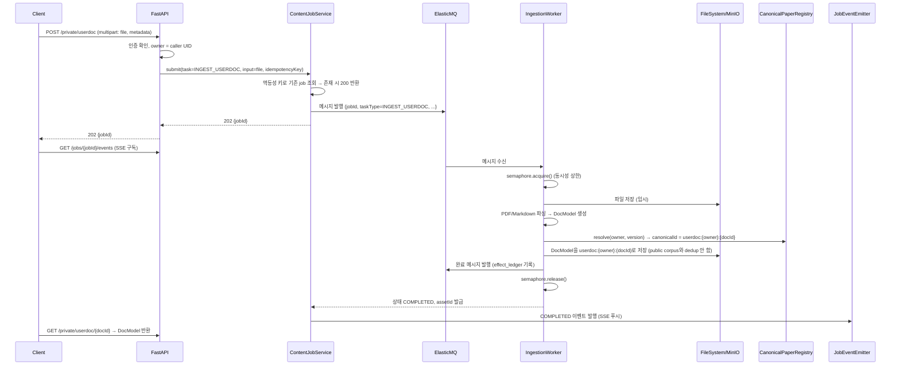
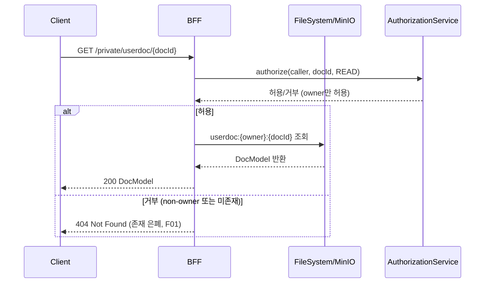
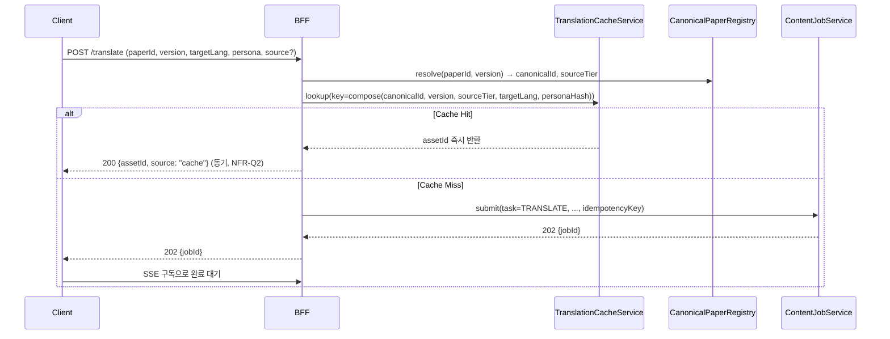
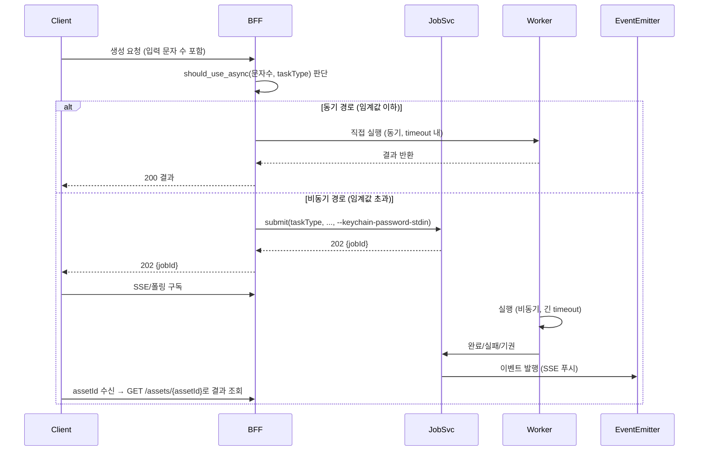
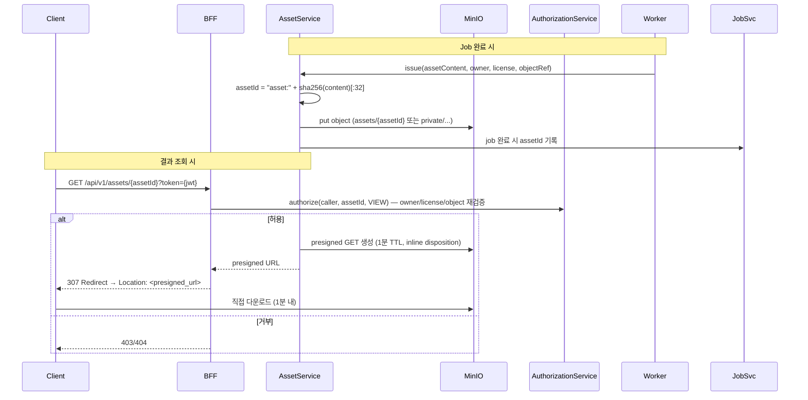
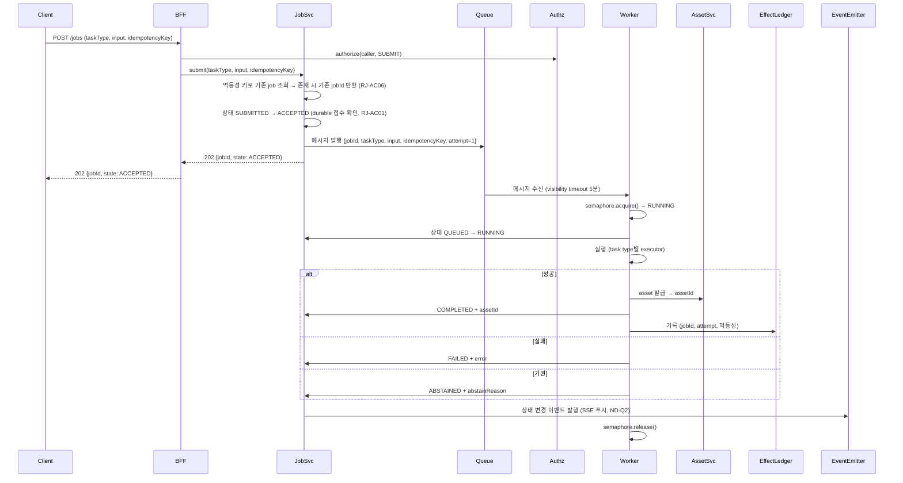
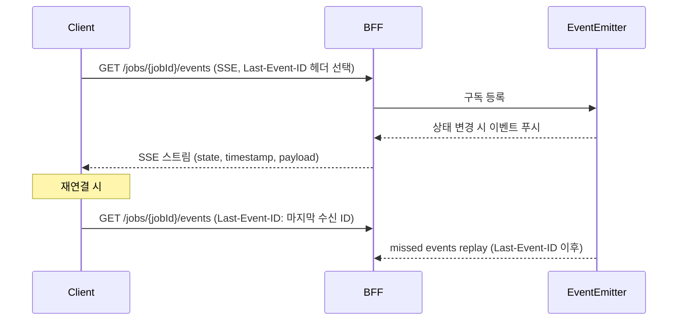

# REM-2 Private Content — Business Logic Model

**단계**: CONSTRUCTION / REM-2 Functional Design Generation Part 2  
**일자**: 2026-09-30  
**기반**: `domain-entities.md` 엔티티 정의, FD-Q1~8 승인 (전수 A)

---

## 1. Private UserDoc Read/Write Flow (FD-Q1, FD-Q5)

### 1.1 Write Path: `POST /private/userdoc`



### 1.2 Read Path: `GET /private/userdoc/{docId}`



**핵심 규칙 (FD-Q1, FD-Q5)**:
- `userdoc:` prefix 경로는 public route(`GET /paper/{id}`)에서 **404로 거부**.
- Non-owner에게는 존재 여부조차 노출하지 않음(404 통일, F01).
- 업로드는 기존 ingestion 파이프라인 재사용(파서/GROBID), 저장만 `userdoc:{owner}:{docId}` prefix로 분리(FD-Q5 A).
- Public corpus와 **dedup 하지 않음** — 사용자 private이므로.

---

## 2. Translation Cache Canonical Identity Binding (FD-Q2, ND-Q1)

### 2.1 Cache Key Composition

```python
def compose_cache_key(
    canonical_paper_id: str,   # Registry.resolve() 결과
    version: int,
    source_tier: SourceTier,   # ARXIV_HTML > SEMANTIC_SCHOLAR_PDF > OPENALEX_PDF > USER_UPLOAD
    target_lang: str,          # 예: "ko"
    persona_hash: str          # persona config SHA256[:16]
) -> str:
    return f"translate:{canonical_paper_id}:{version}:{source_tier.value}:{target_lang}:{persona_hash}"
```

**핵심 규칙 (FD-Q2 A, ND-Q1 A)**:
- `canonical_paper_id`는 **오직** `CanonicalPaperRegistry.resolve(paperId, version)`으로만 확정.
- Client가 제공한 `source` 파라미터는 **완전히 무시** — 서버가 정한 canonical identity만 사용.
- `source_tier`는 품질 순위(`ARXIV_HTML` > `SEMANTIC_SCHOLAR_PDF` > `OPENALEX_PDF` > `USER_UPLOAD`)로 고정.

### 2.2 Cache Lookup Flow



**핵심 규칙 (FD-Q2 A, NFR-Q8 A, ND-Q1 A)**:
- Client 제공 `source` 파라미터는 **무시** — 서버가 canonical identity 확정 후 cache key 구성.
- Cache hit 시 **동기 200 반환** (`assetId` 포함), model 미실행(RJ-AC07, NFR-Q2 A).
- Cache miss 시 job 접수 → 202 반환 → SSE/폴링으로 완료 대기(FD-Q3, ND-Q3).

---

## 3. Generation Timeout: Job/Pending/Poll Transition (FD-Q3, NFR-Q3, ND-Q3)

### 3.1 Threshold-Based Branching

```python
def should_use_async(input_chars: int, task_type: TaskType) -> bool:
    thresholds = {
        TaskType.TRANSLATE: 12_000,
        TaskType.SUMMARIZE: 8_000,
        TaskType.NOVELTY: 16_000,
        TaskType.EVIDENCE: 20_000,
    }
    return input_chars > thresholds[task_type]
```

### 3.2 Sync vs Async Flow



**핵심 규칙 (FD-Q3 A, NFR-Q3 A, ND-Q3 A)**:
- 임계값: 번역 12k, 요약 8k, novelty 16k, evidence 20k 문자.
- 동기 경로: 브라우저 timeout(15~30s) 내 완료 보장.
- 비동기 경로: job 접수(202) → SSE event(`ACCEPTED→QUEUED→RUNNING→COMPLETED/FAILED/ABSTAINED`) → 완료 시 `assetId`로 결과 조회(RJ-AC08).
- `--keychain-password-stdin`로 비밀번호 전달(비동기 job용).

---

## 4. Private Asset Serving (FD-Q4, ND-Q4, ID-Q7)

### 4.1 Asset Issuance & Serving Flow



### 4.2 Presigned Token (JWT)

```python
def create_asset_token(asset_id: str, caller: str, action: str = "view") -> str:
    payload = {
        "assetId": asset_id,
        "action": action,
        "nonce": uuid4().hex,
        "exp": int(time.time()) + 60,  # 1분 TTL
        "sub": caller,
    }
    return jwt.encode(payload, ASSET_JWT_SECRET, algorithm="HS256")
```

**핵심 규칙 (FD-Q4 A, ND-Q4 A, ID-Q7 A)**:
- `GET /api/v1/assets/{assetId}?token={jwt}` → owner/license/object 재검증 → MinIO presigned GET(1분 TTL) → `307 Redirect`.
- 브라우저가 MinIO(`127.0.0.1:9000`)에서 직접 다운로드, BFF 대역폭 절약.
- CSP: `img-src 'self' http://127.0.0.1:9000` (ID-Q7 A).
- 토큰 1분 TTL, `nonce`로 재사용 방지(ND-Q7 A).

---

## 5. Content Job Pipeline & State Machine (FD-Q6, FD-Q7, ND-Q2, ND-Q6)

### 5.1 State Machine

```
SUBMITTED → ACCEPTED → QUEUED → RUNNING → COMPLETED | FAILED | ABSTAINED
```

- **전이 규칙**: 순방향만 허용, 역전환 불가. `SUBMITTED`에서 검증 실패 시 즉시 `FAILED`.
- **Terminal 상태**: `COMPLETED`(assetId 있음), `FAILED`(error 있음), `ABSTAINED`(abstainReason 있음, 근거 없음/초극단 거절).
- **멱등성**: `idempotencyKey`로 기존 job 조회 → 존재 시 기존 `jobId` 반환(RJ-AC06, ND-Q6 A).

### 5.2 Job Submission Flow (RJ-AC01)



### 5.3 Event Subscription & Replay (RJ-AC04, ND-Q2)



**핵심 규칙 (FD-Q6 A, ND-Q2 A, RJ-AC04)**:
- 상태 변경 시 `JobEventEmitter`가 `JobEvent{jobId, state, timestamp, payload?}` 발행.
- SSE endpoint `GET /jobs/{jobId}/events`가 스트림 제공.
- 재연결 시 `Last-Event-ID` 헤더로 missed event replay.
- `COMPLETED` 시 `assetId` 포함, `FAILED` 시 `error`, `ABSTAINED` 시 `abstainReason`.

---

## 6. RK/DELIVERY/EDGE/UI/AUTH First Content-Job Integration (FD-Q7, ND-Q5)

### 6.1 Boundary Middleware Chain (ND-Q5 A)

```mermaid
graph LR
    A[Client Request] --> B[RateLimitMiddleware\n(NFR-Q10)]
    B --> C[AuthzMiddleware\n(NFR-Q7, RJ-AC05/11)]
    C --> D[JobSubmitHandler\n(RJ-AC01)]
    D --> E[Queue\n(ElasticMQ)]
    E --> F[Worker\n(semaphore + attempt)]
    F --> G[AuthzRecheck\n(실행 직전)]
    G --> H[TaskExecutor\n(TRANSLATE/SUMMARIZE/...)]
    H --> I[AssetService\n(RJ-AC08)]
    I --> J[EffectLedger\n(ND-Q8)]
    J --> K[EventEmitter\n(SSE)]
    K --> L[Client SSE/Asset]
```

### 6.2 Boundary Responsibilities

| 경계 | 컴포넌트 | 책임 | 검증 시점 |
|---|---|---|---|
| **RK** (번역 cache/캐논니컬 source) | `CanonicalPaperRegistry` + `TranslationCache` | canonical identity 확정, cache key 구성, hit 시 model skip | Job 접수 전 (cache lookup), 실행 전 (registry) |
| **DELIVERY** (자산/결과 전달) | `AssetService` + `AssetController` | assetId 발급, presigned URL 생성, owner/license 재검증 | Job 완료 시, asset 조회 시 |
| **EDGE** (ingress identity/rate-limit) | `RateLimitMiddleware` + Cloudflare→BFF identity 체인 | client identity 검증, task type별 token bucket | 요청 접수 시 (모든 엔드포인트) |
| **UI** (frontend status/asset) | `JobStatus` (SSE) + `AssetViewer` (presigned URL) | 상태 표시(submitted→completed), presigned URL로 자산 렌더링 | SSE 구독, asset 조회 시 |
| **AUTH** (인가/세션) | `JobAuthzMiddleware` + `AuthorizationService` | 모든 단계에서 caller/object 권한 재검증, 만료 시 즉시 failed | 각 단계 진입 시 (접수/큐/실행/status/event/asset) |

**핵심 규칙 (FD-Q7 A, ND-Q5 A)**:
- 각 경계를 독립 middleware/hook로 구현, `JobContext`로 데이터 전달.
- `JobAuthzMiddleware`가 **모든 단계**(접수, 큐 진입, 실행, status, event, asset)에서 `authorize(caller, jobId, action)` 재검증(NFR-Q7 A).
- 권한 만료/철회 시 즉시 `FAILED` + event `permission_revoked` 발행(RJ-AC11).

---

## 7. U11/U12/U13 Consumer Contracts (FD-Q8 A)

### 7.1 U11 Evidence Agent → Content Job

- `EvidenceFormationPort.form_evidence(question, papers, attachments) -> EvidenceResult`
- U11은 **직접 파싱/근거형성 로직 재구현 금지** — `ContentJobService.submit(task=EVIDENCE, ...)` 호출만 허용.
- 입력: `EvidenceRequest{question, paper_ids[], attachments[]}` → job 접수 → SSE로 진행 수신 → 완료 시 `EvidenceResult` 반환.

### 7.2 U12 Novelty Agent → Content Job

- `EvidenceFormationPort` 결과 + `SourceRef`만 소비.
- `ContentJobService.submit(task=NOVELTY, input={evidence_result, manuscript})` 호출.
- U12는 **직접 파싱/근거형성 로직 재구현 금지** — upstream port만 소비.

### 7.3 U13 Agent Chat Frontend → Content Job

- `/agent` route에서 `문헌탐색&근거형성` 또는 `novelty` mode 선택.
- `submit()` → `subscribeEvents()` → `getAsset()`로 결과 수신.
- `JobStatus` 컴포넌트가 SSE 구독해 상태 표시(`submitted→accepted→queued→running→completed/failed/abstained`).
- `AssetViewer`가 presigned URL로 자산 렌더링.

**핵심 규칙 (FD-Q8 A, ND-Q9 A)**:
- U11/U12/U13는 `ContentJobService` port만 소비, **직접 파싱/근거형성 로직 재구현 금지** (static analysis로 CI 차단).
- 공통 계약: `EvidenceItem`, `SourceRef`, `JobEvent`, `AssetId`는 `docsuri_shared._generated`에서 import.

---

## 8. Scenario Summary (15 Scenarios)

| # | 시나리오 | 핵심 엔티티/플로우 | 검증 포인트 |
|---|---|---|---|
| 1 | Private userdoc write → read | `PrivateUserDoc`, `ContentJob`(INGEST), `PrivateUserDoc` read | owner read 성공, non-owner 404 |
| 2 | Translation cache hit | `TranslationCacheEntry`, `CanonicalPaperRegistry` | 동기 200 + assetId, model 미실행 |
| 3 | Translation cache miss | `ContentJob`(TRANSLATE), `TranslationCacheEntry` 생성 | Job 접수 → SSE → 완료 → asset 조회 |
| 4 | Sync generation (임계값 이하) | `ContentJob` 동기 실행 | 브라우저 timeout 내 200 반환 |
| 4 | Async generation (임계값 초과) | `ContentJob` 비동기, SSE | 202 → SSE 상태 전이 → 완료 asset 조회 |
| 5 | Asset serving | `AssetService`, presigned JWT, MinIO | 307 redirect → MinIO 직접 다운로드 |
| 6 | Job authz recheck | `JobAuthzMiddleware`, 권한 만료 | 실행 직전 만료 → 즉시 FAILED + event |
| 7 | Queue redelivery | `EffectLedger`, attempt 멱등성 | Worker crash → redelivery → 중복 ledger 0 |
| 8 | Cache hit translation | `TranslationCacheEntry`, canonical identity | 동기 200, model 미실행, client source 무시 |
| 9 | Private userdoc read (non-owner) | `PrivateUserDoc`, owner 검증 | 404 (존재 은폐) |
| 10 | Rate-limit | `RateLimitBucket`, identity별 | 동일 identity 급증 → 429 |
| 11 | Timeout alignment | `TimeoutProfile`, 레이어별 역산 | 동기 경로 브라우저 timeout 내 완료 |
| 12 | U11 evidence job | `ContentJob`(EVIDENCE), `EvidenceFormationPort` | U11이 port만 호출, 직접 로직 금지 |
| 13 | U12 novelty job | `ContentJob`(NOVELTY), upstream port만 소비 | U12가 직접 파싱/근거형성 재구현 금지 |
| 14 | U13 frontend SSE | `JobStatus` SSE 구독, `AssetViewer` | 상태 표시 + presigned URL 자산 렌더 |
| 15 | Queue loss/crash recovery | `EffectLedger`, RJ-AC12 | 중복 효과 0, 상태 정확 복구 |

---

## 9. Traceability Matrix

| FD Question | Domain Entity | Business Flow | Scenario | Business Rule |
|---|---|---|---|---|
| FD-Q1 (private read) | `PrivateUserDoc` | 1.2 Read Path | 1, 9 | BR-PRIV-01: non-owner 404 |
| FD-Q2 (cache canonical) | `TranslationCacheEntry`, `CanonicalPaperRegistry` | 2.2 Cache Lookup | 2, 8 | BR-CACHE-01: client source 무시 |
| FD-Q3 (timeout branching) | `ContentJob`, `TimeoutProfile` | 3.2 Sync/Async | 4, 5 | BR-JOB-01: 임계값 기반 분기 |
| FD-Q4 (asset serving) | `Asset`, `AssetService` | 4.1 Asset Serving | 5 | BR-ASSET-01: presigned redirect |
| FD-Q5 (userdoc write) | `PrivateUserDoc`, `ContentJob`(INGEST) | 1.1 Write Path | 1 | BR-PRIV-02: public corpus와 dedup 안 함 |
| FD-Q6 (job state machine) | `ContentJob`, `JobEvent` | 5.1 State Machine, 5.2 Submit | 6, 7 | BR-JOB-02: 전이 불변식, 멱등성 |
| FD-Q7 (RK/DELIVERY/EDGE/UI/AUTH) | `JobAuthzMiddleware`, `AssetService`, `RateLimitBucket` | 6.1 Boundary Chain | 6, 10, 11 | BR-AUTHZ-01: 전 단계 재검증 |
| FD-Q8 (U11/U12/U13 contracts) | `ContentJobService`, `EvidenceFormationPort` | 7.1~7.3 Consumer Contracts | 12, 13, 14 | BR-CONS-01: port만 소비, 직접 로직 금지 |
