# REM-3 Lifecycle and Edge Trust — Business Logic Model

**단계**: CONSTRUCTION / REM-3 Functional Design Generation Part 2  
**일자**: 2026-09-30  
**기반**: `domain-entities.md`, FD-Q1~8 승인 (전수 A)

---

## 1. Purge Lifecycle Flow (F04, R3C)

### 1.1 Account Deletion Request → Soft Delete

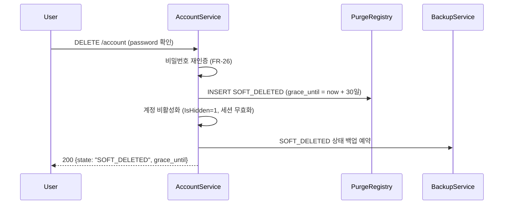

### 1.2 Grace Period → Hard Delete (Purge Worker)

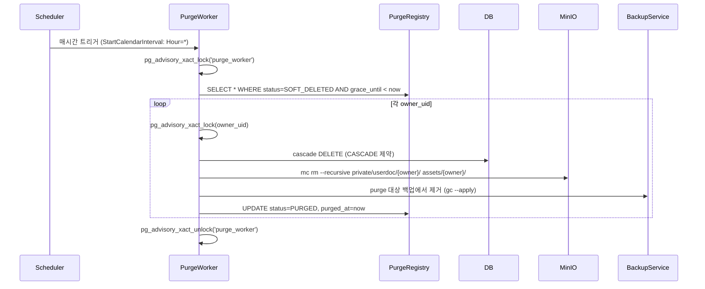

**핵심 규칙 (FD-Q1 A, FD-Q4 A)**:
- `pg_advisory_xact_lock`으로 동시 실행 방지 + 개별 owner 락
- `ON DELETE CASCADE` + application-level cascade로 완전 파기
- 재실행 멱등: 이미 `PURGED`면 skip

---

## 2. Unsubscribe Token Flow (F09, FD-Q2)

### 2.1 Token 발급

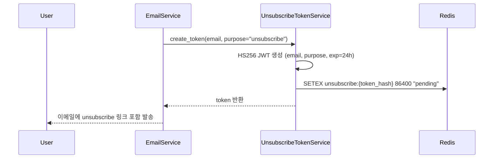

### 2.2 Token 검증 + 수신 해지

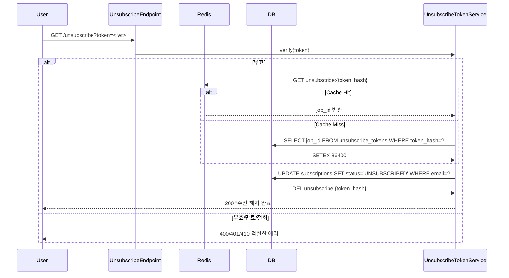

**핵심 규칙 (FD-Q2 A, ND-Q2 A)**:
- HS256 JWT로 토큰 자체에 payload 포함 (stateless 검증 가능)
- Redis cache로 token→job_id 매핑, DB lookup 최소화
- 토큰 1회용, 검증 후 즉시 Redis에서 삭제

---

## 3. Rate-Limit Identity Chain (F10, FD-Q3, FD-Q6)

### 3.1 Identity Chain Flow

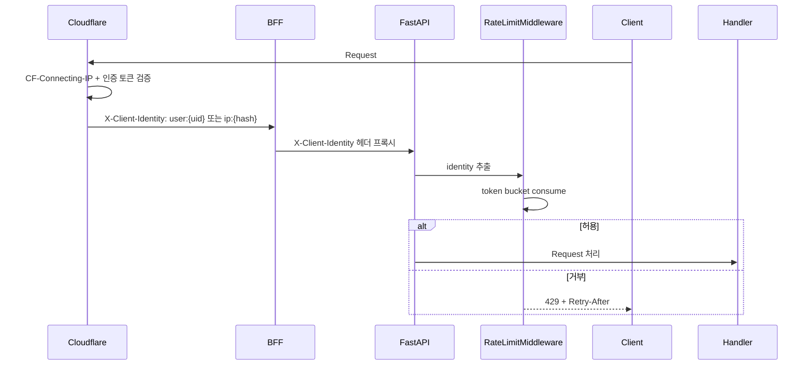

**핵심 규칙 (FD-Q3 A, FD-Q6 A, ND-Q3 A)**:
- Cloudflare에서 `CF-Connecting-IP` + 인증 토큰 검증 후 `X-Client-Identity` 헤더 설정
- BFF는 헤더만 프록시, 검증하지 않음
- FastAPI `RateLimitMiddleware`가 identity별 token bucket 적용
- Identity: 인증 `user:{uid}`, 익명 `ip:{sha256(ip)[:16]}`

---

## 4. Consent/Token Revocation + Redis Pub/Sub (R3P, FD-Q5, ND-Q5)

### 4.1 Revocation 발행

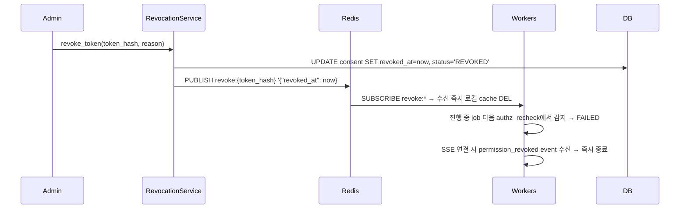

**핵심 규칙 (FD-Q5 A, ND-Q5 A, ND-Q10 A)**:
- Redis pub/sub로 즉시 전파 (지연 없음)
- 모든 worker가 `SUBSCRIBE revoke:*` 구독
- 수신 즉시 로컬 cache `DEL`, 진행 중 작업은 다음 authz recheck에서 차단
- SSE 연결은 `permission_revoked` event 수신 시 즉시 종료

---

## 5. Consent/Token Lifecycle (R3P, FD-Q5, FD-Q8)

### 5.1 Consent Grant → Revoke → Expire

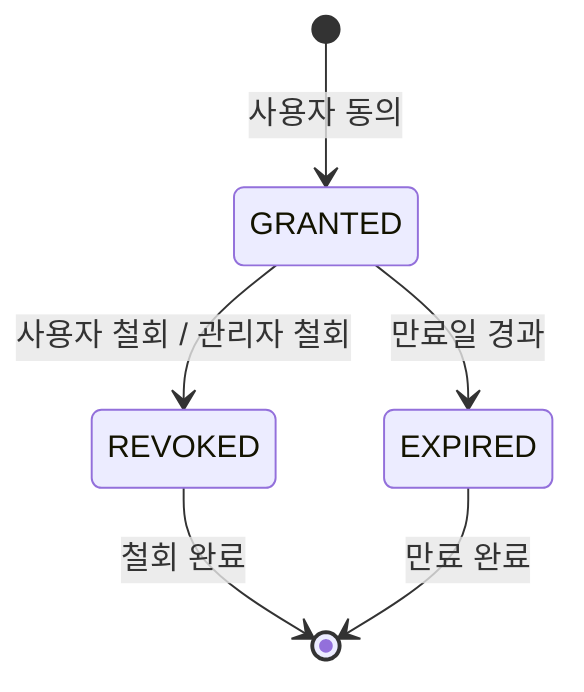

**핵심 규칙 (FD-Q5 A, FD-Q8 A)**:
- `GRANTED` → `REVOKED` (즉시, `revoked_at` 설정)
- `GRANTED` → `EXPIRED` (만료일 경과 시 자동)
- 철회 시 Redis pub/sub로 즉시 전파, 토큰 즉시 무효화

---

## 6. Account Lifecycle (FR-26/27/28/44~46, FD-Q8)

### 6.1 Account Deletion: Soft Delete → Grace → Hard Delete

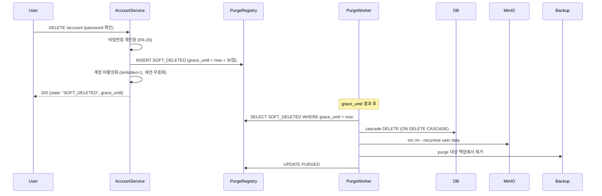

### 6.2 Password Reset (FR-26)

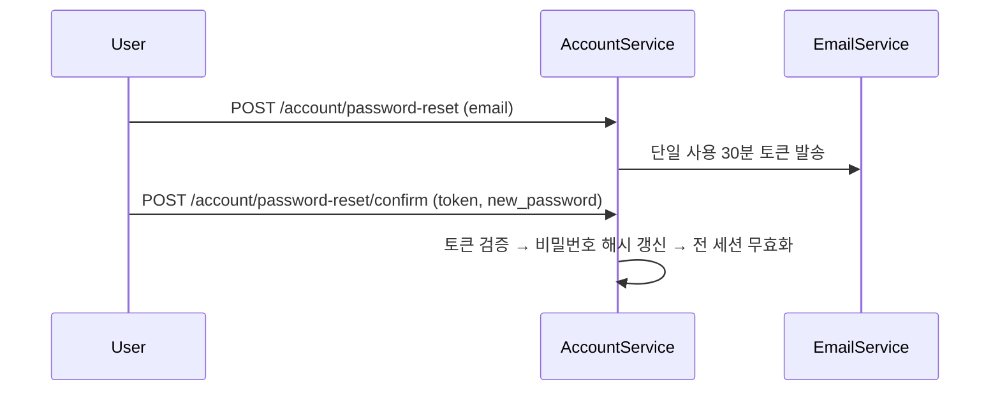

### 6.3 Social Login (Google/ORCID) (FR-27)

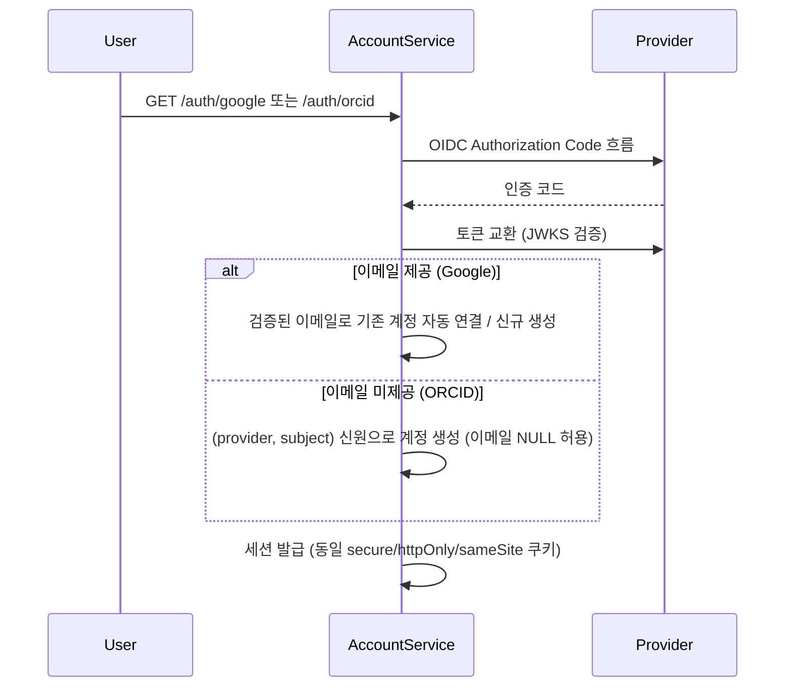

### 6.3 Account Management (FR-28)

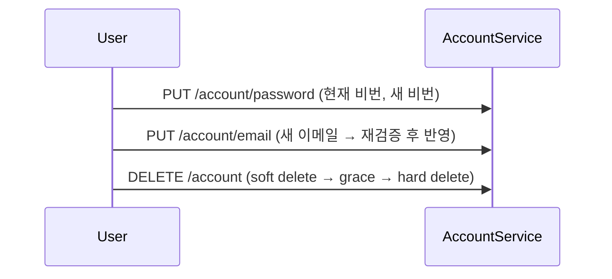

---

## 7. Edge Trust: Ingress Identity + Rate-Limit (R3E, FD-Q6)

### 7.1 Ingress Identity Verification

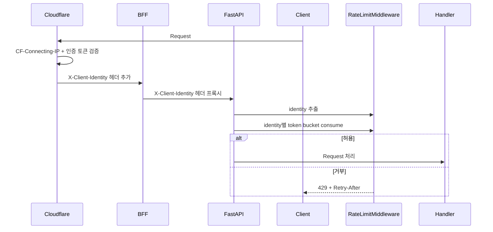

**핵심 규칙 (FD-Q6 A, ND-Q3 A, ND-Q6 A)**:
- Cloudflare에서 `CF-Connecting-IP` + 인증 토큰 검증 → `X-Client-Identity` 헤더
- BFF는 헤더만 프록시, 검증 안 함
- FastAPI `RateLimitMiddleware`가 identity별 token bucket 적용
- 동일 identity 동일 버킷, spoofing 불가

---

## 8. Backup/Restore: Purge 대상 포함 (ID-Q7)

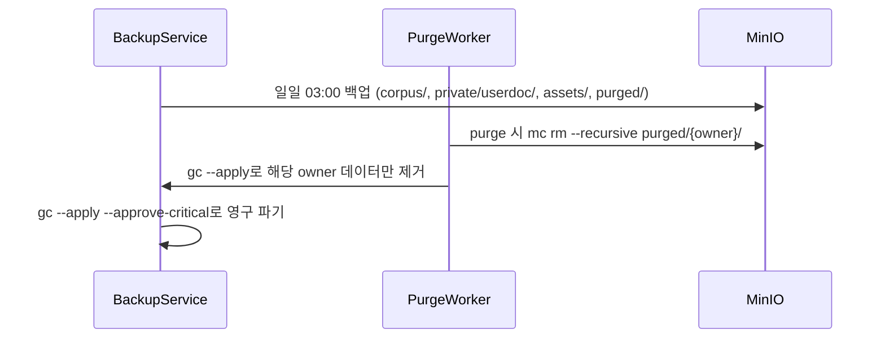

---

## 9. Keychain Provisioning: Unsubscribe JWT Signing Key (ID-Q8)

```mermaid
sequenceDiagram
    participant Operator
    provision_rem2_keys.py
    Keychain
    
    Operator->>provision_rem2_keys.py: --profile test
    provision_rem2_keys.py->>Keychain: create-keychain -p password
    provision_rem2_keys.py->>Keychain: add-generic-password -s docsuri.rem2.unsubscribe -a unsubscribe-jwt -w <32-byte-secret>
    provision_rem2_keys.py->>Keychain: set-keychain-settings -l -t 300
    provision_rem2_keys.py->>Keychain: set-key-partition-list -S apple: -k ...
    Keychain-->>Operator: All Keychains provisioned successfully
```

---

## 9. Traceability Matrix

| FD Question | Domain Entity | Business Flow | Scenario | Business Rule |
|---|---|---|---|---|
| FD-Q1 (purge) | `PurgeRegistry`, `AccountLifecycleState` | 1.1, 1.2, 6.1 | SC-PURGE-01, SC-PURGE-02 | BR-PURGE-01~07 |
| FD-Q2 (unsubscribe) | `UnsubscribeToken` | 2.1, 2.2 | SC-UNSUB-01, SC-UNSUB-02 | BR-UNSUB-01~04 |
| FD-Q3 (rate-limit) | `RateLimitBucket`, `ClientIdentity` | 3.1 | SC-RL-01 | BR-RL-01~04 |
| FD-Q4 (purge lifecycle) | `PurgeRegistry`, `AccountLifecycleState` | 1.2, 6.1 | SC-PURGE-02, SC-PURGE-03 | BR-PURGE-08 |
| FD-Q5 (consent) | `ConsentRecord`, `RevocationEvent` | 4.1, 5.1 | SC-CONSENT-01, SC-REV-01 | BR-CONSENT-01~04 |
| FD-Q6 (edge trust) | `ClientIdentity`, `EdgeTrustPolicy` | 7.1 | SC-EDGE-01 | BR-EDGE-01~04 |
| FD-Q7 (이관 경로) | `ContentJob`, `UnsubscribeToken` | 3.1, 2.2 | SC-CONS-01 | BR-CONS-01 |
| FD-Q8 (account lifecycle) | `AccountLifecycleState`, `AccountService` | 6.1, 6.2, 6.3 | SC-ACC-01~03 | BR-ACC-01~04 |
