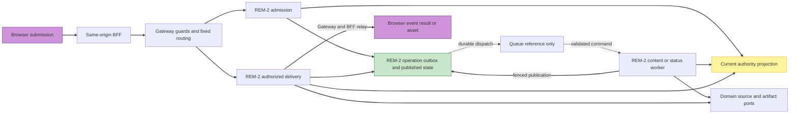
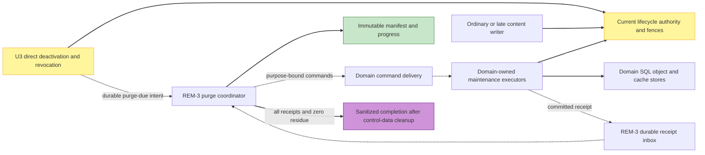

# component-dependency.md — 의존성 매트릭스·통신 패턴·데이터 흐름 (Application Design)

> **현재 승인 설계**: 하단 `2026-09-19 Deployable Services and Public Jobs`가 DAD1=A로 승인된 dependency/data-flow다. source import와 synchronous call DAG를 asynchronous command/receipt feedback과 구분한다. 기존 superseded 흐름은 이력이다.

> kind 표기: **sync**(요청→응답, 블로킹) / **event**(이벤트 백본, 비동기 fire-and-forget·구독) / **lib**(프로세스 내 라이브러리/함수 호출).
> 잠금 결정 준수: 디스커버리 사용자 READ 경로는 전부 sync(DQ6); 인제스천·이력 쓰기·인시던트·관측성은 event 백본.

## 비평 반영 요약 (이 문서 관련)
- 팬텀 `U2.DiscoveryService`/`U2-DiscoveryAPI`/`U2 Discovery(consumer)` 명칭을 실재 표면(`QueryIntakeController`(REST 진입), `SearchOrchestrationService`(서비스 파사드))로 통일.
- **SearchExecuted 생산자 엣지 신설**: `U2.SearchOrchestrationService → Event Backbone (event)`.
- **rerun 게이트웨이 재진입**: `U4.* → U6.ApiGatewayMiddleware (sync, 게이트웨이-프런티드 검색 계약)`로 재배선(U2 직접 호출 제거).
- 팬텀 `IncidentSignalPublisher`를 `IncidentEventPublisher`/`HallucinationDetector`(실재 U6 컴포넌트)로 대체. 세 탐지기를 1급 엔드포인트로 선언.
- SEC-8 소유권: `U6.AuthnAuthzGuard → U3.AuthorizationGuard (lib, 위임)`; `U4.* → U3.AuthorizationGuard (sync)`는 단일 결정점; `U4.UserDataRepository`는 데이터 백스톱.
- U2↔U6 의존 방향: 게이트웨이=호출자(U6→U2 핸들러), 근거화·비용 후크=주입 lib(U2→U6 hooks, kind:lib) — sync 순환 아님.
- VectorSpec 공유 계약 엣지 신설: `U1.EmbeddingGatewayAdapter`·`U2.QueryUnderstandingExpander` → Shared Embedding Gateway VectorSpec.

---

## 1. U1 — Corpus Ingestion (이벤트/스케줄 백본)

| from | to | kind | purpose |
|---|---|---|---|
| CorpusRefreshScheduler | Scheduler/Timer (shared capability) | event | source별 스케줄 시간 트리거로 증분 갱신·backfill·rebuild 잡 개시(US-I2, FR-6). |
| RefreshOrchestrationService | IngestionPipelineService | lib | 스케줄/이벤트 생성 잡의 논문을 파이프라인 오케스트레이터로 분배(워커 내부). |
| IngestionPipelineService | CorpusSourceAdapterSet | lib | arXiv·Semantic Scholar·OpenAlex 메타·전문 후보 조회(FR-6, C-1). |
| CorpusSourceAdapterSet | arXiv / Semantic Scholar / OpenAlex (external upstreams) | sync | 워커→외부 학술 소스 동기 조회(레이트/쿼터 RES-8, 타임아웃 RES-9). **사용자 동기 경로 아님 — 워커 내부 업스트림.** |
| IngestionPipelineService | FullTextExtractionProcessor | lib | HTML/PDF 원천에서 FullText 추출, PDF는 transient GROBID 처리, 라이선스 검증(C-1, SEC-5). |
| FullTextExtractionProcessor | GROBID Runtime (shared capability) | sync | Semantic Scholar/OpenAlex PDF 및 arXiv PDF fallback 전문 구조화 추출. 원시 PDF 저장 없음. |
| IngestionPipelineService | SourcePriorityDeduplicationGuard | lib | DOI→arXiv id→title/author/year 기준 cross-source 중복 제거와 canonical version 결정(NFR-C1, QT-9). |
| IngestionPipelineService | DocModelBuildCoordinator | lib | `(paperId, version)`별 eager DocModel 생성·검증·S3 저장(FR-18, QT-9). |
| DocModelBuildCoordinator | Object Storage (shared capability) | sync | DocModel JSON과 FullText/asset 참조 저장. 원시 PDF 저장 금지(C-1, SEC-9). |
| IngestionPipelineService | DocModelBlockChunker | lib | DocModel Block 경계 기반 결정적 청크 생성(FR-6, FR-5 지원). |
| IngestionPipelineService | EmbeddingGatewayAdapter | lib | 청크 배치 벡터화 호출(FR-6). |
| EmbeddingGatewayAdapter | Embedding Gateway (shared capability) | sync | 워커→임베딩 게이트웨이 동기 호출로 벡터 생성(타임아웃·서킷 RES-9). |
| **EmbeddingGatewayAdapter** | **Shared Embedding Gateway VectorSpec (shared contract)** | **lib** | **공유 임베딩 스키마(차원·모델·거리 메트릭) 단일 진실 원천 소비 — U2 reader와 벡터 공간 호환 보장(인덱스 정합성).** |
| EmbeddingGatewayAdapter | Cost Telemetry (shared X-cutting) | event | 임베딩 사용량/비용 텔레메트리 발행(NFR-C1, DQ5 횡단 레이어). |
| IngestionPipelineService | CorpusIndexWriter | lib | 임베딩+lexical+DocModel Block anchor를 공유 OpenSearch generation에 멱등 기록(FR-6, FR-2, FR-18). |
| CorpusIndexWriter | OpenSearch / Vector Store (shared capability) | sync | 워커→인덱스 스토어 동기 upsert/tombstone. U2 reader 공유 인덱스 generation 생성(재생성 가능 RES-2). |
| IngestionPipelineService | IngestionResilienceService | lib | 모든 단계 오류 분류·재시도/백오프·DLQ·경보 위임(US-I3, RES-9/8/7). |
| IngestionResilienceService | Dead-Letter Queue (shared capability) | event | 소진/영구 실패 격리로 인덱스 정체·손상 방지(US-I3). |
| IngestionResilienceService | Observability/Alerting (shared X-cutting) | event | 실패 신호·잡 건강도 발행(RES-7, NFR-O1); 운영 U6 라우팅. |
| U1-Ingestion | U6.ObservabilityHub | event | 인제스천 워커 갱신 성공/실패·재시도 텔레메트리 비동기 제출(RES-7, US-I2). |

> **읽기/쓰기 분리 주석**: U1.CorpusIndexWriter는 공유 Corpus 인덱스의 **write-only 생산자**, U2.HybridRetriever는 **read 소비자**. 단일 writer·단일 reader.

---

## 2. U2 — Discovery (동기 읽기 경로)

| from | to | kind | purpose |
|---|---|---|---|
| QueryIntakeController | SearchOrchestrationService | sync | 검증된 동기 검색 요청을 도메인 오케스트레이터로 위임(요청→응답, NFR-P1). |
| QueryIntakeController | QueryValidator | lib | 진입 시 도메인 입력 검증·정규화(FR-1/SEC-5; 실패 시 업스트림 비전송). |
| SearchOrchestrationService | QueryUnderstandingExpander | sync | 정규화 질의를 임베딩+lexical QueryPlan으로 확장(FR-2). |
| SearchOrchestrationService | HybridRetriever | sync | 공유 arXiv 인덱스 하이브리드 후보 검색(FR-2). |
| SearchOrchestrationService | RelevanceRanker | sync | 후보 관련도순 상위 N 정렬(FR-3, QT-2). |
| SearchOrchestrationService | GroundingAdapter | lib | 후보+검색 레코드를 U6 근거화 후크 입력으로 정형화·verdict 매핑(독자 강제 없음, FR-5). |
| SearchOrchestrationService | ResultAssembler | sync | 근거화 결과/기권/저하를 폰 DTO 조립(FR-4, FR-11). |
| QueryUnderstandingExpander | LlmGatewayAdapter (shared X-cutting, U6 게이트웨이 경유) | sync | 임베딩 생성·LLM 질의 확장; 비용/저하 신호 시 우회(NFR-C1). |
| **QueryUnderstandingExpander** | **Shared Embedding Gateway VectorSpec (shared contract)** | **lib** | **질의 임베딩 모델·차원·거리 메트릭을 U1 인덱스와 동일 공유 계약에서 해석 — 벡터 공간 호환 선언 불변식.** |
| HybridRetriever | VectorStoreAdapter (shared adapter) | sync | 벡터 ANN 시맨틱 검색; 공유 AI/ML Corpus 인덱스 읽기(FR-2). |
| HybridRetriever | LexicalIndexAdapter (shared adapter) | sync | lexical 텀 검색; 하이브리드 병합·저하 폴백(FR-2, NFR-R2). |
| RelevanceRanker | LlmGatewayAdapter (shared X-cutting, U6 경유) | sync | 선택적 LLM 리랭킹; cost-circuit 'rerank off' 시 baseline 폴백(NFR-C1, US-R3). |
| SearchOrchestrationService | U6.CostGuardCircuitBreaker (DegradationSignal) | sync | 요청 스코프 degradation/cost-circuit 신호 수신(LLM/rerank on-off) 저하 분기(NFR-C1, RES-9, US-R2/R3). |
| SearchOrchestrationService | U6.ObservabilityHub | event | 지연·검색/근거화 건강도·반쪽짜리 결과 신호를 메트릭/트레이스로 emit(NFR-O1, RES-5, RES-11(c)). |
| **SearchOrchestrationService** | **Event Backbone (shared async)** | **event** | **성공 검색 후 `SearchExecutedEvent{userId, query, timestamp, resultCount}` 발행 → U4 이력 비동기 기록(FR-10, NFR-P1 비차단, P50<3s 경로 밖).** |
| QueryIntakeController | U6.ApiGatewayMiddleware (DQ5 게이트웨이) | sync | 사용자 동기 검색 READ가 게이트웨이 전처리(검증·인증·인가·레이트리밋·관측성)를 통과(DQ6 동기 REST). |

> **근거화 invocation 주석**: U2는 `GroundingEnforcementHook.enforce`를 직접 호출하지 않는다. 근거화 강제는 U6.GatewayPipelineService가 U2 라우트 응답 엣지(post-handler)에서 단일 적용한다(아래 U6 섹션). 할루시네이션 인시던트 발행도 U6 단독.

---

## 3. U3 — Accounts/Auth

| from | to | kind | purpose |
|---|---|---|---|
| U6.ApiGatewayMiddleware (DQ5) | SessionVerifier | sync | 요청별 인증 강제: 게이트웨이가 토큰을 검증해 주체를 다운스트림 주입(SEC-8/12). |
| U6.ApiGatewayMiddleware (DQ5) | AccountController | sync | 검증·레이트리밋·입력 검증 통과 후 가입/로그인/로그아웃 라우팅(SEC-11/5). |
| AccountController | SignupService | sync | 가입 요청 도메인 로직 위임(FR-7/US-A1). |
| AccountController | AuthenticationService | sync | 로그인/로그아웃 도메인 로직 위임(FR-7/US-A2). |
| SignupService | PasswordPolicy | lib | 비밀번호 정책·유출 검사 평가(SEC-12). |
| SignupService | CredentialStore | lib | 이메일 유일성·적응형 해싱 생성·영속(SEC-12). |
| AuthenticationService | CredentialStore | lib | 자격증명 검증·노후 해시 재해싱(SEC-12). |
| AuthenticationService | SessionManager | lib | 성공 인증 세션 발급·로그아웃 무효화(SEC-12/US-A2). |
| SessionVerifier | SessionManager | lib | 요청 토큰 서버측 검증 위임(SEC-8). |
| SessionManager | SessionStore | lib | 세션 레코드 영속·조회·삭제로 서버측 검증·무효화(US-A2/SEC-8). |
| PasswordPolicy | Breach-Dataset Adapter (shared common adapter) | sync | 유출 비밀번호 검사; 타임아웃·서킷·페일클로즈드(RES-9/SEC-15). |
| SignupService | Event Backbone (shared async) | event | `AccountCreated`·`SignupAbuseSignal` 발행 → 관측성·남용 탐지·Ops(SEC-11/NFR-O1/RES-11). |
| AuthenticationService | Event Backbone (shared async) | event | `AuthFailureSignal` 발행 → 무차별 대입 탐지·락아웃/지연/CAPTCHA·Ops 경보(SEC-12/RES-11). |
| U6.AuthnAuthzGuard | **AuthorizationGuard** | lib | **객체 단위 소유권 결정을 U3 단일 권위 결정점에 위임(재구현 아님, SEC-8) — token-verify 위임과 동형.** |
| U4.SavedSearch/Library/History 도메인 | **AuthorizationGuard** | sync | 사용자 데이터 접근 시 객체 단위 소유권 인가를 U3 단일 결정점에 요청(SEC-8). |

---

## 4. U4 — Saved Searches & Library

| from | to | kind | purpose |
|---|---|---|---|
| U4.SavedSearchController | U6.ApiGatewayMiddleware (authn/authz, rate-limit, observability) | sync | DQ5: 진입 전 인증·인가(SEC-8/12)·레이트리밋(SEC-11)·구조화 로깅(NFR-O1). LibraryController/SearchHistoryController 동일. |
| U4.SavedSearchController | U4.SavedSearchService | sync | REST 요청을 도메인 유스케이스로 위임. |
| U4.LibraryController | U4.LibraryService | sync | REST 요청을 라이브러리 유스케이스로 위임. |
| U4.SearchHistoryController | U4.SearchHistoryService | sync | 이력 읽기/재실행/삭제를 유스케이스로 위임. |
| U4.SavedSearchService | U4.UserDataRepository | lib | owner-scoped 검색 저장 CRUD(SEC-8 데이터 백스톱). |
| U4.LibraryService | U4.UserDataRepository | lib | owner-scoped 라이브러리 멱등 CRUD. |
| U4.SearchHistoryService | U4.UserDataRepository | lib | owner-scoped 이력 기록/조회/삭제. |
| U4.UserDataRepository | Shared.PersistenceAdapter (DB/object storage capability) | lib | DQ4 공유 레이어: 실제 데이터스토어 접근(at-rest 암호화 SEC-1, 타임아웃·재시도 RES-9). |
| U4.SavedSearchService | **U6.ApiGatewayMiddleware (게이트웨이-프런티드 검색 계약 → U2.SearchOrchestrationService)** | sync | **rerun 시 저장 query를 게이트웨이 경유 동기 검색으로 위임 — 근거화·비용·관측성 후크 통과(DQ5/DQ6, U2 직접 호출 아님).** |
| U4.SearchHistoryService | **U6.ApiGatewayMiddleware (게이트웨이-프런티드 검색 계약 → U2.SearchOrchestrationService)** | sync | **이력 rerun 동기 검색을 게이트웨이 경유로 위임(DQ5/DQ6).** |
| **U2.SearchOrchestrationService** | U4.SearchHistoryService (via Event Backbone) | event | U2가 발행한 `SearchExecuted`를 공유 이벤트 버스로 U4가 구독해 이력 비동기 기록(DQ6 백본, NFR-P1 비차단). |
| U4.SavedSearchService | Shared.AuditLogger (append-only) | event | 검색 저장/삭제 핵심 변경 감사 기록(SEC-13/14). |
| U4.LibraryService | Shared.AuditLogger (append-only) | event | 라이브러리 add/remove 감사 기록(SEC-13/14). |
| U4.SavedSearchController | U4.UserDataDTOAndValidation | lib | 입력 검증·새니타이즈(SEC-5)·DTO 매핑. 전 U4 컨트롤러 공통. |
| U4 (all components) | U3.AuthorizationGuard (auth context, via gateway) | sync | 현재 사용자 식별·객체 소유권 인가를 U3 단일 결정점에서 소비(SEC-8/12). 검증은 게이트웨이가 U3 호출해 AuthContext 주입. |

---

## 5. U5 — Mobile Web Frontend

| from | to | kind | purpose |
|---|---|---|---|
| SearchScreen | ApiClient | sync | 자연어 질의를 동기 REST 검색으로 전송·정렬 결과 수신(DQ6 동기 read, NFR-P1, FR-2). |
| AccountScreens | ApiClient | sync | 가입/로그인/로그아웃 동기 REST·세션 결과(FR-7, SEC-12). |
| LibraryHistoryScreens | ApiClient | sync | 저장 검색/라이브러리/이력 조회·변이 동기 REST(FR-8/9/10, SEC-8). |
| ResultCard | ApiClient | sync | 결과 카드 라이브러리 저장 변이 동기 REST(FR-9). |
| ApiClient | Backend REST API (U6 gateway/middleware) | sync | 프런트 모든 데이터 입출력을 동기 REST로 백엔드 게이트웨이 위임(인증/인가/레이트리밋/근거화는 백엔드 횡단; DQ5, DQ7). |
| SsrRenderService | ApiClient | sync | SSR 시 라우트별 초기 데이터 동기 프리패치로 첫 페인트(NFR-U1, NFR-P1). |
| SsrRenderService | SecurityHeaderPolicy | lib | SSR 응답에 자기-프레이밍 예외 포함 보안 헤더/CSP 부착(SEC-4). |
| SsrRenderService | AppShell | lib | 라우트·세션에 맞춘 화면 트리 렌더 호출. |
| AppShell | PhoneMockupFrame | lib | 데스크톱/태블릿 폰 목업 중앙 배치·폰 풀블리드 분기(NFR-U2). |
| AppShell | SearchScreen | lib | 검색 라우트 화면 마운트(히어로 US-H1 진입). |
| AppShell | AccountScreens | lib | 계정 라우트 화면 마운트·세션 공유(SEC-8). |
| AppShell | LibraryHistoryScreens | lib | 보호된 라이브러리/이력 라우트 마운트·인증 가드(SEC-8). |
| SearchScreen | ResultList | lib | 정렬된 상위 N건 결과 렌더 위임(FR-3). |
| ResultList | ResultCard | lib | 개별 논문 폰 최적화 카드 렌더(FR-4). |
| SearchScreen | StateView | lib | 빈/실패/저하/로딩 상태 렌더 위임(FR-11, NFR-R1, SEC-15, QT-3). |
| ResultList | StateView | lib | 부분 결과/저하 배너 등 결과 영역 상태 위임(FR-11, RES-11). |
| AccountScreens | StateView | lib | 레이트리밋/락아웃/오류 비기술 메시지 표면화(FR-11, SEC-11). |
| LibraryHistoryScreens | StateView | lib | 빈 목록/인가 오류 상태 표면화(FR-11, SEC-8). |
| LibraryHistoryScreens | SearchScreen | lib | 저장 검색/이력 재실행 시 검색 화면 흐름 재사용(FR-8, FR-10). |
| PhoneMockupFrame | SecurityHeaderPolicy | lib | 자기-프레이밍 마크업이 SEC-4 frame-ancestors=self 정합하도록 정책 계약 공유(SEC-4). |

---

## 6. U6 — Reliability & Operations (횡단 미들웨어 + 운영)

| from | to | kind | purpose |
|---|---|---|---|
| U2.QueryIntakeController | ApiGatewayMiddleware | sync | 사용자 동기 검색 READ가 게이트웨이 전처리 통과(DQ6 동기 REST, NFR-P1). |
| U3.AccountController | ApiGatewayMiddleware | sync | 가입/로그인/세션 요청이 입력 검증·레이트리밋·보안 헤더 적용(SEC-5/11/12). |
| U4.* Controllers | ApiGatewayMiddleware | sync | 검색 저장/라이브러리/이력 요청이 객체 단위 소유권 인가를 미들웨어 위임(SEC-8). |
| ApiGatewayMiddleware | InputValidationGuard | lib | 입력 검증·새니타이즈 위임(SEC-5, FR-1). |
| ApiGatewayMiddleware | AuthnAuthzGuard | lib | 인증/세션 검증·객체 단위 인가 결정 위임(SEC-8/12). |
| ApiGatewayMiddleware | RateLimiter | lib | 검색·가입 엔드포인트 레이트 리미팅 위임(SEC-11). |
| AuthnAuthzGuard | U3.SessionVerifier | sync | 서버측 토큰/세션 검증을 U3와 동기 협력(SEC-12). |
| AuthnAuthzGuard | U3.AuthorizationGuard | lib | **객체 단위 소유권 결정을 U3 단일 권위 결정점에 위임(재구현 아님, SEC-8).** |
| ApiGatewayMiddleware | GroundingEnforcementHook | lib | **U2 라우트 응답 엣지(post-handler) 단일 근거화 강제 호출(FR-5, US-D5/D6) — 유일 invocation site.** |
| U2.SearchOrchestrationService | CostGuardCircuitBreaker | sync | 동기 경로 `getBudgetState`로 비용 저하 모드 조회·분기(NFR-C1, NFR-R2). |
| ApiGatewayMiddleware | ObservabilityHub | lib | 요청/응답 단위 메트릭·구조화 로그·트레이스·감사 제출(NFR-O1, SEC-3/14). |
| GroundingEnforcementHook | **HallucinationDetector** (AiIncidentDetectorSuite 서브컴포넌트) | event | 근거화 미통과 위반 신호 비동기 방출 → 할루시네이션 인시던트 탐지(RES-11(b)). |
| CostGuardCircuitBreaker | **CostExplosionDetector** (AiIncidentDetectorSuite 서브컴포넌트) | event | 인트라데이 지출 급증 신호 비동기 방출 → 비용 폭발 인시던트 탐지(RES-11(a)). |
| CostGuardCircuitBreaker | ObservabilityHub | event | usage/cost 텔레메트리·임계 경보 비동기 공급(NFR-C1, RES-5). |
| ObservabilityHub | AiIncidentDetectorSuite | event | 수집 텔레메트리를 이벤트 백본 팬아웃해 세 인시던트 클래스 탐지기 공급(RES-11, DQ6 비동기). |
| ObservabilityHub | OpsDashboardService | sync | 대시보드가 집계 텔레메트리 동기 조회해 OP 뷰 구성(NFR-O1, US-R4). |
| AiIncidentDetectorSuite | IncidentEventPublisher | lib | 분류 인시던트·경보를 발행 어댑터로 전달(RES-11). |
| IncidentEventPublisher | Event Backbone | event | typed 인시던트/경보 이벤트 발행해 IR/COE 라우팅(RES-11, US-R4). |
| AiIncidentDetectorSuite | Event Backbone | event | 탐지 워커가 텔레메트리/위반/지출/완결성 이벤트 비동기 소비(DQ1 별도 워커, DQ6 비동기). |
| HealthCheckService | ObservabilityHub | lib | 얕은·깊은 헬스 체크·의존성 건강도 관측성 제출(RES-6/7). |
| ReliabilityEvalProbe | (HealthMonitoringService 내부) | lib | QT-3 신뢰성/저하 평가셋 실행(GroundingEnforcementHook.runEvalSet의 신뢰성 대응물). |
| Router/LoadBalancer | HealthCheckService | sync | 라우팅 계층이 헬스 엔드포인트 동기 프로빙해 비정상 인스턴스 제외(RES-6, US-R5). |
| HealthCheckService | External Dependencies (arXiv/LLM gateway/vector store) | sync | 깊은 체크가 핵심 의존성 연결성 타임아웃 검증(RES-6/9). |
| OP-Operator | OpsDashboardService | sync | OP가 관리자 인가(SEC-8)+MFA(SEC-12)로 대시보드/인시던트 뷰 동기 조회(NFR-O1, US-R4). |

---

## 7. 통신 패턴 요약

- **동기(sync) 경로 = 사용자向 READ/CRUD (NFR-P1 P50<3s 적용 대상)**
  - 프런트(U5.ApiClient) → U6.ApiGatewayMiddleware → 도메인 핸들러(U2/U3/U4) → 응답.
  - U2 검색 파이프라인 전 단계 sync; 어댑터(VectorStore/Lexical/LLM 게이트웨이) 호출도 sync.
  - U4 rerun도 게이트웨이-프런티드 검색 계약으로 **동일 sync 경로 재진입**(후크 통과).
- **이벤트(event) 백본 = 인제스천·이력 쓰기·인시던트·관측성·감사 (비차단)**
  - 인제스천: source별 스케줄/backfill → U1 워커 → Corpus 인덱스(write-only).
  - 이력 쓰기: U2 `SearchExecuted` → U4.SearchHistoryService 비동기 기록.
  - 인시던트: 근거화 위반/비용 급증/완결성 → 탐지기 → IncidentEventPublisher → 백본 → IR/COE.
  - 관측성: 전 유닛 → ObservabilityHub → 팬아웃 → 탐지기·대시보드.
- **lib = 프로세스 내 호출**: 도메인 모듈 내부, 가드 위임, 어댑터 호출, 공유 VectorSpec 계약.

### 비순환성(acyclicity) 주석 — U2↔U6
게이트웨이는 호출자다: `U6.ApiGatewayMiddleware → U2 핸들러`(인바운드 래핑). 핸들러 내부의 `GroundingEnforcementHook`·`CostGuardCircuitBreaker`는 **주입된 횡단 lib**(U2 → U6 hooks, kind:lib)다. 따라서 토폴로지는 "1개 인바운드 체인 + 주입 lib"이며 sync 순환이 아니다. U4↔U2 back-edge(`SearchExecuted`)는 event-kind라 순환 아님.

---

## 8. 데이터 흐름 ASCII

### (A) Corpus 인제스천 이벤트 경로 (비동기 백본, 사용자 경로 아님)
```
[Scheduler/Timer] ──event──▶ CorpusRefreshScheduler ──▶ RefreshOrchestrationService
                                                             │ lib
                                                             ▼
 CorpusSourceAdapterSet ──sync(upstream)──▶ [arXiv / Semantic Scholar / OpenAlex]
        │ lib
        ▼
 FullTextExtractionProcessor ──sync──▶ [GROBID Runtime]  (PDF transient, raw PDF not stored)
        │ lib
        ▼
 SourcePriorityDeduplicationGuard ─lib▶ DocModelBuildCoordinator ─sync▶ [Object Storage]
        (DOI→arXiv→title/author/year)     (eager DocModel, paperId+version)
                                                    │ lib
                                                    ▼
 DocModelBlockChunker ─lib▶ EmbeddingGatewayAdapter ─sync▶ [Embedding Gateway]
        (Block anchors)                 (VectorSpec shared contract)
                                                    │
                                                    ▼
                                   CorpusIndexWriter ─sync▶ [OpenSearch / Vector Store]
                                   (generation upsert, write-only producer)
 실패 전 단계 ─lib▶ IngestionResilienceService ─event▶ [DLQ] / [Observability/Alerting → U6]
```

### (B) 디스커버리 동기 경로 (NFR-P1 P50<3s, 요청→응답)
```
[Phone/Browser]
   │ sync REST
   ▼
U5.ApiClient ──sync──▶ U6.ApiGatewayMiddleware ──(전처리: 헤더→검증→authN/Z(→U3.AuthorizationGuard)→rate-limit→cost-state)
   │                                  │ sync 위임
   │                                  ▼
   │                       U2.QueryIntakeController ─sync▶ SearchOrchestrationService
   │                                  │ sync 순차
   │   QueryValidator.normalize ──▶ Expander.expand ──▶ HybridRetriever.retrieve ──▶ RelevanceRanker.rank
   │        (PBT-02)              (VectorSpec 공유)     [Vector/Lexical adapters]      (PBT-03)
   │                                  │
   │                                  ▼ lib (정형화)
   │                          GroundingAdapter.toGroundingInput
   │                                  │
   │       ┌── 응답 엣지(post-handler) U6.GatewayPipelineService 단일 적용 ──┐
   │       ▼                                                                │
   │  U6.GroundingEnforcementHook.enforce (FR-5/QT-1 단일 게이트)            │
   │       │  pass/block/abstain                위반 ─event▶ HallucinationDetector (RES-11(b))
   │       ▼                                                                │
   │  GroundingAdapter.mapDecision ──▶ ResultAssembler.assemble (PBT-09) ◀──┘
   │                                  │
   ◀──────────── sync 응답(폰 DTO) ───┘
   │
   └─(응답 후, 비차단) U2.SearchOrchestrationService ─event▶ [Event Backbone] ─▶ U4.SearchHistoryService.recordSearch (FR-10)
```

### (C) 저하/인시던트 경로 (비동기 운영 백본)
```
CostGuardCircuitBreaker ─sync getBudgetState─▶ U2 (LLM/rerank off → lexical 폴백, QT-3 검증 대상)
        │ event 급증
        ▼
CostExplosionDetector ─┐
HallucinationDetector ─┼─▶ AiIncidentDetectorSuite.classify ─lib▶ IncidentEventPublisher ─event▶ [Event Backbone] ─▶ IR/COE, OpsDashboard
PartialResultDetector ─┘            ▲
                                    │ event 팬아웃
        전 유닛 ─sync/event─▶ ObservabilityHub ─event▶ (탐지기 공급) / ─sync▶ OpsDashboardService
ReliabilityEvalProbe.runReliabilityEvalSet (QT-3) ──▶ HealthMonitoringService 보고
```

---

## 7. U11 — Evidence Formation Agent 의존성 (재인셉션 Phase 4)

| from | to | kind | purpose |
|---|---|---|---|
| EvidenceChatController | EvidenceChatService | lib | 채팅 턴 오케스트레이션 위임(FR-36, NFR-P6). |
| EvidenceChatController | EvidenceSessionManagementService | lib | 세션 CRUD 오케스트레이션 위임(FR-38). |
| U6.ApiGatewayMiddleware | EvidenceChatController | sync | 게이트웨이 전처리(authn/authz·검증·rate-limit·비용·관측성) 통과 후 진입(DQ5). |
| EvidenceChatService | EvidenceAgentOrchestrator | lib | Agent 실행·스트리밍 응답 위임. |
| EvidenceChatService | EvidenceSessionRepository | lib | 세션 load/create/appendTurn(FR-38). |
| EvidenceSessionManagementService | U3.AuthorizationGuard | lib | **SEC-8 소유권 결정 위임 — 단일 권위 결정점.** |
| EvidenceSessionManagementService | EvidenceSessionRepository | lib | 세션 delete/reset owner-scoped(FR-38). |
| EvidenceAgentOrchestrator | EvidencePaperSearchTool | lib | 논문 검색 도구 호출(자율 오케스트레이션, FR-37). |
| EvidenceAgentOrchestrator | EvidenceDocModelTool | lib | DocModel 블록 읽기 도구 호출(FR-37, FR-18). |
| EvidenceAgentOrchestrator | EvidenceExtractor | lib | DocModel 블록 → EvidenceItem 추출(C-2, FR-5). |
| EvidenceAgentOrchestrator | EvidenceComparisonAssembler | lib | EvidenceItem → 비교표+쟁점 오버레이 조립(Q2=A). |
| EvidenceAgentOrchestrator | AttachmentDocModelAdapter | lib | 첨부 문서 일시 처리(Q6=A, FR-18). |
| EvidenceAgentOrchestrator | LLM Gateway (shared capability) | sync | Agent 추론·추출·의사결정 LLM 호출(타임아웃·서킷 RES-9). |
| EvidencePaperSearchTool | OpenSearch / Vector Store (shared capability) | sync | 공유 코퍼스 인덱스 검색(auto/mixed scope; IndexRecord 반환). |
| EvidenceDocModelTool | Object Storage (shared capability) | sync | DocModel JSON·블록 읽기(S3 read, paperId+recordRef 기반). |
| AttachmentDocModelAdapter | Object Storage (shared capability) | sync | 첨부 파일 일시 처리·DocModel 추출(원시 파일 미저장). |
| EvidenceFormationService | EvidenceAgentOrchestrator | lib | EvidenceFormationPort.form_evidence → Agent 라우팅(D5 구현). |
| EvidenceFormationService | Job Queue (shared capability) | event | 긴 분석 비동기 잡 발행(NFR-P6, Q9=A). |
| U11.EvidenceFormationService | shared/ports.EvidenceFormationPort | lib | **D5 계약 구현 — U12 연구아이디어 Agent(미래)가 추상에만 의존해 소비(순환 차단).** |
| U11 | U6.ObservabilityHub | event | 채팅 턴 지연·에러·스트리밍 건강도 메트릭 제출(NFR-O1). |

### (D) 근거형성 Agent 경로 (동기 스트리밍 + 비동기 잡 옵션)
```
[Phone/Browser]
   │ sync REST (SSE)
   ▼
U5.ApiClient ──sync──▶ U6.ApiGatewayMiddleware ──(전처리: 헤더→검증→authN/Z→rate-limit→cost-state)
                                  │ sync 위임
                                  ▼
                    U11.EvidenceChatController
                                  │ lib
                                  ▼
                    EvidenceChatService
                          │ lib
                          ▼
                EvidenceAgentOrchestrator.run(request, ctx)
                    │ lib (자율 순서로 반복 호출)
                    ├──▶ EvidencePaperSearchTool ─sync▶ [Vector Store]
                    ├──▶ EvidenceDocModelTool ─sync▶ [Object Storage]
                    ├──▶ AttachmentDocModelAdapter (Q6=A 첨부)
                    ├──▶ LLM Gateway (추론·추출)
                    ▼
              EvidenceExtractor → EvidenceComparisonAssembler
                    │
                    ▼
          EvidenceResult | EvidenceAbstainResult (state=ok/abstain)
                    │ SSE stream
◀──────── EvidenceChatController ─stream▶ [Phone/Browser]

[긴 분석 — 비동기 잡 옵션 (NFR-P6)]
EvidenceChatService ─event▶ [Job Queue] ─▶ Worker: EvidenceAgentOrchestrator
                                              │ 완료
                                              ▼
                                    EvidenceSessionRepository (결과 저장)
                                              │
                    Client ─sync▶ GET /api/evidence/jobs/:id (폴링)
```

---

## 2026-09-19 F01-F13 교정 의존성 개정

> **SUPERSEDED - 2026-09-19 UQRF1=B**: 아래 in-process/package dependency model은 이력이다. 네 deployable services의 network/data/control-plane topology와 failure boundaries를 재설계한다.
>
> RQ1=A에 따라 의존성은 기존 deploy/package 경계를 유지한다. composition root가 포트 구현과 purge target specs를 조립하며, 도메인 패키지가 서로의 controller나 persistence 구현을 직접 import하지 않는다.

### 9. REM-1 - Platform and Contract Integrity

| from | to | kind | purpose / gate |
|---|---|---|---|
| Backend startup | OrderedMigrationRegistry | lib | startup migration 전에 단일 ordered registry 검증(F08). |
| Migration CLI | OrderedMigrationRegistry | lib | startup과 동일 identity/order 소비; 별도 path list 금지(F08). |
| OrderedMigrationRegistry | Migration runner | lib | 검증된 package-relative MigrationSpec만 전달. |
| Migration runner | Postgres migration ledger | sync | script DDL과 ledger insert를 script별 transaction으로 적용. |
| ContractGenerationPipeline | `shared` schema roots | build | schema 자동 발견; hard-coded subset 금지(F13). |
| ContractGenerationPipeline | LocalSchemaRegistry | lib | `$id`/`$ref`를 offline 해소; network lookup 금지. |
| ContractGenerationPipeline | Python/TypeScript build-consumed bindings | build | temporary tree 전체 성공 후 원자 publish; drift gate 입력. |
| RuntimeSupplyChainVerifier | Deploy-unit runtime manifests/locks/images | build | production runtime, frozen lock, digest, advisory를 검증(F06). |
| RuntimeSupplyChainVerifier | CI artifact store | build | deploy unit별 SBOM과 승인 예외 evidence publish. |

### 10. REM-2 - Private Content and Generation

| from | to | kind | purpose / gate |
|---|---|---|---|
| Public summary/DocModel/asset controllers | PublicPaperNamespacePolicy | lib | storage lookup 전에 `userdoc:`를 동일 일반화 응답으로 차단(F01/F07). |
| Evidence/novelty owner-context controllers | UserDocModelCoordinator | lib | authenticated owner로만 private DocModel/asset ref 검증·읽기(F01). |
| PublicPaperNamespacePolicy | UserDocModelCoordinator | prohibited | public route가 private reader로 자동 fallback하거나 범용 private endpoint를 형성하지 않는다(RQ2=A). |
| SummaryRequestOrchestrationService | CanonicalSummarySourceResolver | lib | client source보다 먼저 server-owned canonical source/digest 확정(F02). |
| CanonicalSummarySourceResolver | Discovery metadata/DocModel ports | sync/lib | server-verified metadata 또는 DocModel capability read; controller 직접 의존 없음. |
| SummaryRequestOrchestrationService | Summary cache | sync | source identity가 포함된 versioned key로만 lookup/write(F02). |
| SummaryRequestOrchestrationService | SummaryGenerationJobRegistry | lib | cache miss의 durable marker 생성/조회(F05). |
| SummaryGenerationJobRegistry | Postgres persistence adapter | sync | job state/attempt/terminal outcome 영속. |
| SummaryRequestOrchestrationService | Summary queue | event | durable marker와 enqueue 결과를 결속; enqueue 실패 시 pending 금지. |
| Summarization worker | SummaryGenerationJobRegistry | sync | lease/running/terminal 상태 기록; visibility/retry budget과 결속. |
| Browser | SameOriginAssetProxy | sync | authenticated same-origin asset 요청(F07). |
| SameOriginAssetProxy | AuthenticatedPaperAssetController | sync stream | session/trusted identity를 전달하고 binary response relay. |
| AuthenticatedPaperAssetController | Asset manifest + object storage | sync stream | public namespace/license/manifest 검증 후 backend-only key로 stream. |
| Browser | Object storage endpoint | prohibited | MinIO/S3 endpoint, presigned URL, object key 직접 노출 금지(F07). |

### 11. REM-3 - Owner Lifecycle and Edge Trust

| from | to | kind | purpose / gate |
|---|---|---|---|
| Composition root | OwnerPurgeRegistry | lib | owner domain별 PurgeTargetSpec을 한 registry로 주입; accounts가 타 도메인 구현을 직접 import하지 않음. |
| DurableOwnerPurgeService | OwnerPurgeRegistry | lib | SQL 삭제 전 coverage 검증과 exact owner inventory 생성(F04). |
| DurableOwnerPurgeService | PurgeManifestRepository | sync | immutable manifest/hash/stage를 durable 저장하고 CAS 전이. |
| DurableOwnerPurgeService | Private object/cache adapters | sync | manifest에 동결된 keys/prefixes만 idempotent 삭제. |
| DurableOwnerPurgeService | Owner SQL/credential adapters | sync | object stage 이후 owner-scoped transaction 삭제와 residue 검사. |
| Digest email renderer | DigestLinkTokenVerifier | lib | `/paper/{id}` link와 issued-at/settings-version token 생성(F09). |
| Exact public unsubscribe route | DigestUnsubscribeController | sync | auth allowlist는 정확한 path 하나만 허용; token 검증으로 mutation authorize. |
| DigestUnsubscribeController | Digest settings repository | sync | owner/version/opted-in compare-and-set; 다른 settings 변경 보존. |
| Cloudflare Tunnel | EdgeClientIdentityForwarder | sync | trusted edge의 단일 client IP 입력(F10). |
| Browser-provided internal identity header | EdgeClientIdentityForwarder | prohibited | inbound spoof 값은 전달하지 않고 항상 제거/overwrite. |
| EdgeClientIdentityForwarder | TrustedClientIdentityResolver | sync | JSON/PDF/SSE 공통 private header 전달. |
| TrustedClientIdentityResolver | Gateway RateLimiter + accounts abuse limiter | lib | request context의 단일 canonical client identity 소비. |
| Non-loopback socket peer | TrustedClientIdentityResolver private header trust | prohibited | internal header를 신뢰하지 않고 요청을 거부. |

### 12. REM-4 - Corpus and Search Integrity

| from | to | kind | purpose / gate |
|---|---|---|---|
| Production seed command | ProductionSeedGuard | lib | explicit non-production mode가 아니면 fixture seed 거부(F03). |
| CorpusIntegrityAuditService | Active OpenSearch alias/backing generation | sync read-only | fixture/source/completeness/generation snapshot 읽기; mutation 없음. |
| CorpusIntegrityAuditor | Immutable audit report store | sync | report hash, generation/index UUID, freshness, readiness reasons publish. |
| CorpusReadinessProvider | Immutable audit report store | sync read-only | current generation과 recent report 비교; OpenSearch 직접 수정 금지. |
| TargetedCorpusRepairService | Backup/restore verifier | sync | verified backup 없이는 manifest/apply 진행 금지. |
| TargetedCorpusRepairService | Candidate OpenSearch generation | sync write | approved exact manifest로 fixture-free candidate 생성/검증. |
| TargetedCorpusRepairService | Active alias | sync atomic | 검증 성공 후 cutover; manifest가 이전 backing generation rollback 소유. |
| Readiness/startup | TargetedCorpusRepairService | prohibited | health probe가 repair/delete/cutover를 호출하지 않는다(RQ6=A). |
| SearchOrchestrationService | ResultAssembler | lib | retrieval 0건에도 degradation/provenance 전달(F11). |
| Frontend ApiClient | SearchStateClassifier | lib | response metadata를 count보다 먼저 판정해 degraded-empty 보존. |
| RelevanceFloorEvaluator | Verified corpus generation + labeled eval set | offline | candidate floors의 false-abstain/false-pass report 생성(F12). |
| RelevanceFloorPolicy | Approved generation-bound calibration report | sync/lib | active generation/model 일치 정책만 search read에 공급. |
| Full corpus rebuild | Automatic repair fallback | prohibited | 별도 명시 승인 전 reparse/reembed/rebuild/alias cutover 금지. |

### 13. 교정 데이터 흐름

#### (E) Public/private 문서와 비동기 생성

1. Public request -> namespace policy -> canonical server source -> source-bound cache key.
2. Cache hit -> immediate response. Cache miss -> durable job marker -> queue enqueue -> `pending`.
3. Repeat request -> same source/job identity -> cached success, terminal failure, or existing `pending`.
4. `userdoc:` public request -> generalized rejection. Owner-context request -> `UserDocModelCoordinator` -> owner-bound object read.
5. Browser asset request -> same-origin BFF proxy -> authenticated backend stream -> object storage; storage endpoint/key never reaches the browser.

#### (F) Durable owner purge

1. Grace expiry -> registry coverage validation -> owner SQL/object/cache inventory.
2. Inventory -> immutable manifest commit -> deterministic deletion event/stage.
3. Manifest objects/cache -> idempotent delete -> stage CAS.
4. Owner SQL/credentials -> transaction delete -> residue and non-owner preservation check.
5. Failure -> persisted stage/error -> resume with the same manifest; no target recomputation.

#### (G) Trusted client identity

1. Cloudflare Tunnel -> BFF validates one `CF-Connecting-IP` and overwrites the private internal header.
2. JSON/PDF/SSE proxy paths use the same forwarding helper.
3. FastAPI raw loopback peer -> resolver accepts private header -> request-scoped canonical client identity.
4. Gateway and accounts limiters consume the same identity; non-loopback/private-header spoof is rejected.

#### (H) Corpus audit, repair, readiness, relevance

1. Read-only auditor snapshots active generation -> immutable generation-bound audit report.
2. Readiness reads the report only and reports stale/mismatch/fixture/completeness reasons.
3. Approved targeted repair uses verified backup + exact manifest -> candidate generation -> validation -> atomic cutover or rollback.
4. Relevance evaluation runs only on a verified generation -> shadow report -> approved floor bound to generation/model -> search enforcement.
5. If completeness requires a full rebuild, flow stops at the separate approval gate.

### 14. 비순환성 및 금지 경계

- `backend.wiring`/composition root가 migration specs와 purge target specs를 조립한다. Registry가 각 도메인 controller/service를 역호출하지 않아 package dependency cycle을 만들지 않는다.
- ingestion은 audit report를 생산하고 backend readiness는 report contract만 소비한다. backend가 ingestion runtime/tooling을 import하지 않는다.
- BFF는 trusted identity와 asset bytes를 relay할 뿐 authz 판단을 소유하지 않는다. FastAPI domain/controller가 최종 authorization을 수행한다.
- public paper route와 owner-context private route는 공유 raw storage adapter 아래에서만 만나며 API/service 경계는 분리된다.
- summary job state는 canonical source identity를 소비하지만 source resolver가 job repository나 worker를 역참조하지 않는다.

---

## 2026-09-19 Deployable Services and Public Jobs

Component ID는 `components.md`, interface는 `component-methods.md`, orchestration은 `services.md` DS-1~8을 따른다. 아래는 설계 의존성이며 현재 코드가 이미 이 구조로 변경됐다는 판정이 아니다.

### 1. Dependency matrix

| From | To | 종류 | 책임 / 금지 우회 |
|---|---|---|---|
| UI | EDGE의 BFF -> gateway | bounded HTTP/event/stream | same-origin 고정 API family만 소비; caller 지정 host/queue/storage URL 금지 |
| EDGE | R2A/R3C/DELIVERY | authenticated bounded sync | 접수 또는 준비된 결과/관측까지. 업무 완료를 기다리는 RPC로 사용하지 않음 |
| EDGE / REM entry / worker | AUTH | library + current projection read | source grant/current head/owner/purpose 확인. 인증은 queue에서 실행하지 않음 |
| R2A/R3C/R4A | RK service-local instance | local transaction | 각 service의 operation/outbox만 원자 저장; 다른 REM 운영 table 직접 수정 금지 |
| RK outbox | 해당 worker/명시 domain executor | durable async command | typed reference/version/correlation. broker ack는 업무 완료 증거가 아님 |
| Domain executor | recipient-scoped CommandProjection | bounded read-only view | immutable 입력/manifest를 해소하고 current parent/run fence 확인. sender의 일반 mutable table 조회나 gateway callback 없음 |
| R2W | U1 source/context projection, U7 business core, EXEC | bounded worker I/O/lib | owner/context/canonical source binding, fenced artifact publication |
| R2W | U1 source builder | async command/receipt | 필요한 source 준비를 domain-owned consumer에 위임; REM-2 worker가 gateway를 역호출하지 않음 |
| DELIVERY | AUTH + 자기 realm의 published view + 허용 artifact port | bounded direct read/stream | 현재 인가된 기존 결과만 전달. read/status business handler를 다시 실행하지 않음 |
| U3 직접 lifecycle 제어 | U3 authority state + lifecycle outbox | direct control + async signal | 비활성화/revocation은 queue보다 먼저 적용; REM-3 가용성을 기다리지 않음 |
| R3P | domain-owned EXEC | durable async command/receipt | quiesce/inventory/purge/verify. 각 domain은 자기 credential과 자기 store만 사용 |
| R3C 및 U15 sender/settings writer | U15-owned ConsentBarrier 계약 | direct safety control | suppression/consent revision/provider handoff 경계 조정. remote REM-3 HTTP를 매 발송의 필수 callback으로 사용하지 않고 승인된 current control projection/adapter를 소비 |
| R3C worker | U15 ApplyOptOut executor | durable async command/receipt | canonical settings ordinary writer는 U15. revision mismatch/실패가 suppression을 조용히 해제하지 않음 |
| R3E | EDGE/U3 policy consumers | versioned artifact distribution | 로컬 verifier/identity normalization에 배포. 매 request마다 REM-3 API를 호출하지 않음 |
| R1R | domain registry/schema/locks + 승인된 mutation port | build / privileged one-shot | 원 domain 정의를 소비하고 evidence 발행. REM-1 daemon의 역호출이나 자동 repair 없음 |
| R1C | immutable platform evidence | read-only | 기존 서비스 실행/요청의 실시간 선결 RPC가 아님 |
| R4A | corpus read ports -> immutable reports | worker read / own publication | corpus writer는 U1, report writer는 REM-4 |
| R4R | U1 fenced mutation port | explicit privileged execution | exact manifest/backup/approval 범위. 일반 daemon/health credential로 실행 불가 |
| SEARCH / OBS | current generation head + verified report/policy | local/read-only | report freshness/binding을 검증하고 U2/U5에서 집행; 검색 hot path의 REM-4 RPC 없음 |
| 모든 entry point | OBS | local signal / durable audit path | correlation/redaction/단계 latency; telemetry 장애가 권한 검증을 우회시키지 않음 |

### 2. Code/import 및 synchronous call DAG

**Source dependency의 허용 순서** (상위가 하위만 import):

| Level | 허용 구성 | 하위 의존 |
|---|---|---|
| C0 | language-neutral schemas, generated DTOs, pure port protocols | 제품 runtime import 없음 |
| C1 | domain business cores, pure RK/validation/state helpers | C0 |
| C2 | store/projection/transport adapters, domain-owned EXEC 구현 | C0/C1 및 외부 SDK |
| C3 | REM/Gateway/기존 domain composition roots와 entry points; UI transport composition | C0~C2의 승인된 계약/구현을 조립 |

service가 다른 service의 entry point/controller/repository 구현을 import하지 않는다. domain library가 gateway/REM composition root를 역참조하지 않는다. REM-3의 target registry는 shared target spec/manifest를 소비하며 타 domain adapter는 해당 owner의 composition root가 바인딩한다. frontend는 생성된 TS 계약을 소비하며 Python runtime import 관계가 없다.

**Synchronous call의 허용 순서**:

1. Browser -> BFF -> 기존 gateway -> 고정 REM daemon 또는 기존 직접 domain control.
2. REM daemon/독립 worker entry -> service-local RK/DELIVERY/domain core -> AUTH/current projection/EXEC/I/O adapter -> store/model/provider.
3. AUTH/current projection은 domain이 소유한 read-only revision/head 계약으로 조회하며 gateway/REM endpoint를 역호출하지 않는다. consent barrier도 domain-owned control adapter이며 원 요청으로 재진입하지 않는다.
4. REM-1 read daemon/REM-4 report daemon 및 각 health는 자기 evidence/dependency를 직접 읽는다. 다른 service의 health가 자신을 다시 호출하는 readiness cycle을 만들지 않는다.

따라서 위 **source 및 synchronous dependency 설계는 DAG**다. asynchronous outbox -> worker -> publication, purge command -> receipt -> coordinator는 의도된 feedback이다. 이를 전체 runtime 통신이 비순환이라고 표현하지 않는다. feedback은 parent operation/command/manifest에 결속하고 새 사용자 job 또는 무제한 status-query chain을 만들지 않는다.

### 3. Content/status job data flow (DS-2/DS-3)



**Text alternative**: UI가 BFF/gateway를 통해 R2A에 제출한다. 현재 권한과 durable operation/outbox가 확인된 뒤 receipt가 반환된다. outbox가 queue reference를 발행하고 worker가 자기 record/current authority/source를 읽어 fenced 결과를 publish한다. 별도의 인가된 직접 DELIVERY 경로가 같은 gateway/BFF를 통해 준비된 event/result/asset을 전달한다. StatusQuery도 한 worker 작업이며 결과 수신은 새로운 status job을 만들지 않는다. 그림의 store/worker feedback은 async 진행 기록이다.

### 4. Purge command/receipt flow (DS-4/DS-5)



**Text alternative**: U3는 직접 owner epoch/session을 닫고 유예 후 durable purge intent를 전달한다. R3P가 domain별 quiescence/삭제/검증 command를 보내고 각 domain-owned executor는 자기 store에서만 처리한다. 실행 receipt가 REM-3 inbox로 돌아오면 coordinator가 manifest 진행을 갱신한다. 모든 target의 residue 및 coordinator 자체 owner control data 정리까지 확인한 뒤 비식별 완료 증거를 남긴다. 늦은 일반 writer는 current lifecycle fence에서 차단된다.

### 5. Consent 및 corpus 흐름의 텍스트 모델

- **Consent**: email token -> exact gateway route -> R3C/U15 ConsentBarrier -> suppression + operation/outbox commit -> restricted observer receipt. U15 sender는 동일 barrier의 current veto를 확인하며, async ApplyOptOut -> U15 settings executor -> receipt는 후속 반영이다. revision 경쟁/불명확 handoff는 성공으로 추정하지 않는다.
- **Corpus**: operator/system audit intent -> R4A worker의 read-only generation snapshot -> immutable audit/calibration evidence -> SEARCH/OBS의 current-head 검증. 별도 승인된 repair runner만 U1 mutation port를 호출한다. report read/health/검색은 repair를 시작하지 않는다.
- **Platform**: domain schema/registry/lock -> 명시적 R1R -> immutable evidence/CompatibilityManifest -> R1C 또는 local validator consumer. daemon availability를 build/bootstrap의 순환 dependency로 두지 않는다.

### 6. 금지 edge와 failure boundaries

- Browser -> REM listener/MinIO/queue, client URL -> 임의 proxy target, public paper -> private `userdoc:` 자동 fallback은 금지한다.
- normal REM credential -> 다른 domain 일반 table write, receipt consumer -> 다른 service operation table 직접 write, user job -> privileged maintenance kind는 금지한다.
- accepted row/old envelope -> 현재 권한 없이 실행, stale event-cache -> 인가 승인, lease expiry -> 외부 I/O quiescence 추정은 금지한다.
- DELIVERY -> 새 source/model job 또는 recursive status query, health -> queue 작업/migration/repair, runtime daemon -> 자동 dependency repair/promotion은 금지한다.
- gateway request -> REM -> gateway callback 형태의 synchronous 재진입은 금지한다. domain 작업은 shared port/current projection 또는 durable command/receipt로 연결한다.
- broker 장애는 direct health와 current authority 판정을 막는 loop가 아니다. 단 current authority store 자체가 실패하면 private 실행/전달은 fail closed한다.
- deployment/operation version mismatch는 명시적 보류/실패이며, rollback이 known-vulnerable legacy route나 두 ordinary writer를 동시에 활성화하지 않는다.
