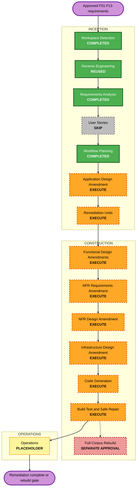
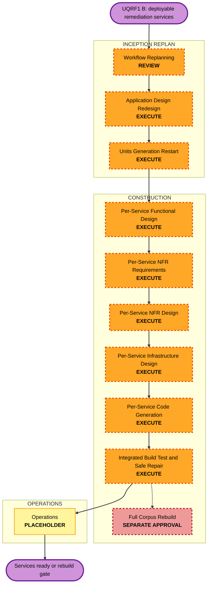
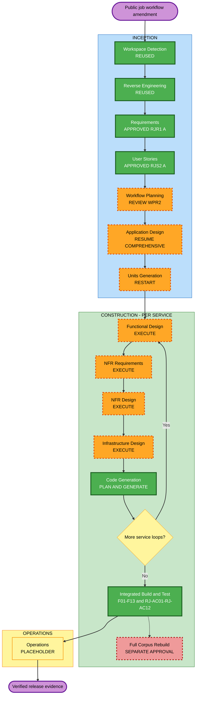

# 검증 결함 F01-F13 교정 워크플로 계획 - 2026-09-18

> **현재 리뷰 대상**: 하단의 `2026-09-19 Public Job Workflow Amendment - WPR2`를 참조한다. RJR1 요구사항과 RJS2 story/persona는 승인됐으며, 이전 planning-overlay 및 WPR1의 Requirements 재사용/User Stories skip 기록은 당시 이력이다.

**단계**: INCEPTION -> Workflow Planning 
**런타임 기준**: single Mac + launchd + OrbStack + Cloudflare Tunnel + Ollama 
**입력**: `verification-remediation-2026-09-18.md`, `project-verification-2026-09-18.md`, 재현 기록, 현재 코드 `32a424d` 
**위험도**: Critical - private data, shared artifact integrity, destructive purge, production corpus, dependency supply chain

## 계획 실행 체크리스트

- [x] 기존 AI-DLC 상태와 승인된 Requirements Analysis 산출물을 로드했다.
- [x] F01-F13의 현재 코드 경로, 테스트 경로, 패키지 의존성을 대조했다.
- [x] Security Full, Resiliency custom single-Mac profile, PBT Full 규칙을 반영했다.
- [x] Application Design, Units Generation, Construction 단계의 실행/건너뜀을 판정했다.
- [x] 모듈 변경 순서, 격리 검증, rollback 및 live repair 게이트를 정의했다.
- [x] Mermaid 문법과 렌더를 `mmdc`로 검증하고 텍스트 대안을 포함했다.

## 상세 분석

### 변환 범위

- **유형**: Brownfield system-wide remediation. 신규 제품 기능이 아니라 승인된 요구사항의 보안, 데이터, 런타임 인수를 회복한다.
- **주요 변경**: private source 인가, canonical source/cache identity, 비동기 생성 예산, owner purge, migration registry, corpus audit/repair, 검색 저하/no-match, supply chain, same-origin asset, digest, trusted client identity, offline contract generation.
- **관련 패키지**: `shared/`, `backend/`, `ingestion/`, `frontend/`, `ops/`, `.github/workflows/`.
- **데이터 변경**: migration ledger와 owner purge coverage를 확장한다. 운영 OpenSearch fixture 제거는 backup/restore 검증과 exact-fingerprint dry-run 후에만 수행한다.
- **금지 경계**: full corpus rebuild, 대량 reparse/reembed, alias cutover는 본 계획의 자동 실행 범위가 아니다. 별도 명시 승인이 필요하다.

### 영향 평가

| 영향 | 판정 | 내용 |
|---|---|---|
| 사용자 경험 | 높음 | private 문서 접근, 요약/번역 완료, 이미지 렌더, 검색 상태, 다이제스트 링크가 변경된다. |
| 구조 | 높음 | 공통 migration registry, object purge, corpus audit/repair, trusted proxy identity가 추가된다. |
| 데이터 모델 | 중간 | 기존 표를 유지하되 migration 원장/삭제 manifest 또는 job state가 필요할 수 있다. |
| API/계약 | 높음 | shared DocModel namespace, summary source, asset URL, generated TypeScript 계약이 변경된다. |
| NFR | 매우 높음 | Security, timeout/backpressure, backup/restore, dependency/SBOM, readiness, reproducible PBT가 직접 영향받는다. |

### 리스크와 rollback

- **Rollback 복잡도**: 높음. SQL과 object deletion은 단일 transaction이 아니며, OpenSearch live repair는 별도 restore 경로가 필요하다.
- **배포 전략**: 기존 GitHub review와 version-pinned in-place deploy를 유지한다. schema/lock/runtime 변경은 각각 독립 rollback 지점을 만든다.
- **데이터 안전**: destructive 작업은 preflight count, encrypted off-host backup, isolated restore, dry-run manifest hash, alias/backing-index 재검증을 모두 통과해야 한다.
- **실행 중지 조건**: backup/restore 실패, candidate count 변화, owner 보존 불변식 실패, unapproved critical/high advisory, corpus generation 불일치 시 live 변경을 수행하지 않는다.

## 컴포넌트 관계

| 컴포넌트 | 변경 유형 | 우선순위 | 직접 finding |
|---|---|---:|---|
| `shared/dtos`, generated bindings | 계약/무결성 | 1 | F01, F02, F07, F13 |
| backend migration registry | 공통 기반 | 1 | F08, F04 |
| dependency locks, CI, images | 공급망/런타임 | 1 | F06 |
| summarization + user docmodel | 인가/캐시/작업/자산 | 2 | F01, F02, F05, F07 |
| accounts + evidence/onboarding/trends/plans | 파기/메일 | 3 | F04, F09 |
| BFF + gateway + accounts controller | trusted client identity | 3 | F10 |
| ingestion + discovery + ops health | corpus/search integrity | 4 | F03, F11, F12 |
| single-Mac operations | backup, restore, logs, alerts, capacity | 횡단 | Security/Resiliency extension |

## 교정 유닛

Units Generation에서 아래 네 구현 유닛을 기존 제품 유닛 위에 겹치는 remediation unit으로 확정한다. 새 deployable product unit은 만들지 않는다.

### REM-1 - Platform and Contract Integrity

- **범위**: F06, F08, F13 및 공통 Security/Resiliency/PBT gate.
- **소유 경로**: locks, Docker/Compose, CI/SBOM, migration registry, schema/type generator.
- **산출**: frozen patched dependencies, digest-pinned runtime, ordered migration SSOT, offline atomic type generation, fixed/logged PBT seed.

### REM-2 - Private Content and Generation

- **범위**: F01, F02, F05, F07.
- **소유 경로**: shared DTO, summarization, user_docmodel, BFF binary transport, frontend viewer.
- **산출**: deny-by-default `userdoc:` public boundary, canonical source-bound cache, bounded async generation, authenticated same-origin assets.

### REM-3 - Owner Lifecycle and Edge Trust

- **범위**: F04, F09, F10.
- **소유 경로**: accounts purge, owner tables/private objects, trends, auth middleware, Cloudflare/BFF/gateway identity.
- **산출**: complete idempotent purge, valid public unsubscribe and `/paper/{id}` links, spoof-resistant per-client rate limiting.

### REM-4 - Corpus and Search Integrity

- **범위**: F03, F11, F12.
- **소유 경로**: ingestion audit/repair, discovery wiring/assembler/eval, frontend search state, ops readiness.
- **산출**: production mock fences, backup-first exact fixture cleanup, honest corpus readiness, degraded-empty preservation, generation-bound no-match shadow/enforcement.

## 모듈 변경 순서

1. REM-1에서 failing regression harness, dependency baseline, PBT seed, migration SSOT와 offline schema registry를 먼저 세운다.
2. REM-2에서 F01 public/private 경계를 먼저 차단하고 F02 canonical source/cache identity를 확정한다.
3. REM-2에서 corrected source/cache identity를 사용해 F05 async budget과 F07 same-origin asset path를 구현한다.
4. REM-3에서 REM-1의 full schema 위에 F04 SQL/object purge를 구현하고, F09 및 F10을 마감한다.
5. REM-4에서 production mock/seeder fence와 F11 backend/frontend 상태 보존을 먼저 구현한다.
6. REM-4에서 read-only corpus audit, backup/restore, dry-run/apply tooling과 readiness를 구현한다.
7. 격리된 fixture-free, source-verified corpus에서만 F12 evaluation을 실행하고 shadow 후 enforce한다.
8. 모든 schema 변경 후 F13 generated tree를 최종 동기화하고 전체 계약/build 검사를 실행한다.
9. isolated verification이 모두 통과한 뒤 versioned rollback 지점을 만들고 safe live repair를 단계별 적용한다.
10. 최근 1년 corpus completeness가 full rebuild를 요구하면 비용, 디스크, 시간, rollback generation을 제시하고 별도 승인을 기다린다.

## 워크플로 시각화

### 텍스트 대안

1. Workspace Detection과 Requirements Analysis는 완료됐고 기존 reverse-engineering baseline을 재사용한다.
2. 신규 사용자 흐름이 없는 결함 교정이므로 User Stories를 건너뛴다.
3. Application Design amendment와 four remediation units 생성을 수행한다.
4. 각 remediation unit에 필요한 Functional/NFR/Infrastructure Design amendment 후 Code Generation을 수행한다.
5. 전체 Build and Test와 backup-first safe live repair를 수행한다.
6. full corpus rebuild 필요 시 자동 진행하지 않고 별도 승인 게이트에서 중지한다.

## 단계 결정

### INCEPTION

- [x] Workspace Detection - COMPLETED.
- [x] Reverse Engineering - REUSED. 최신 전체 검증과 코드 baseline이 존재하므로 재생성을 건너뛴다.
- [x] Requirements Analysis - COMPLETED AND APPROVED.
- [x] User Stories - SKIP. 신규 사용자 workflow가 아닌 명확한 결함 교정이다.
- [x] Workflow Planning - COMPLETED, REVIEW GATE.
- [x] Application Design amendment - COMPLETED AND APPROVED. ordered migration, contract generation, private content/job/asset, purge manifest, digest/edge identity, corpus audit/repair/readiness/relevance 경계를 5개 mandatory artifact에 확정했다.
- [ ] Units Generation - EXECUTE. 여섯 패키지에 걸친 의존 순서와 destructive/live gate를 four remediation units로 관리해야 한다.

### CONSTRUCTION

- [ ] Functional Design amendments - EXECUTE. owner authorization, cache identity, purge idempotency, token expiry, degraded/no-match 불변식을 명시한다.
- [ ] NFR Requirements amendment - EXECUTE. timeout, backup/RTO/RPO, supply chain, encryption, logging, capacity, PBT Full 인수를 구체화한다.
- [ ] NFR Design amendment - EXECUTE. async job, retry/visibility, fail-closed repair, rollback, trusted proxy, audit/readiness 패턴을 확정한다.
- [ ] Infrastructure Design amendment - EXECUTE. single-Mac launchd/OrbStack/Cloudflare/backup/log/alert/image pin 경로를 현재 runtime에 매핑한다.
- [ ] Code Generation - EXECUTE. 각 unit별 승인된 detailed plan과 regression-first 구현을 수행한다.
- [ ] Build and Test - EXECUTE. 전체 lane, isolated stores, browser/BFF, security audit, SBOM, backup/restore, live preflight를 검증한다.

### OPERATIONS

- [ ] Operations - PLACEHOLDER. AI-DLC Operations 단계는 아직 정의되지 않았으며, 승인된 safe live repair는 Build and Test의 통제된 배포 검증으로 기록한다.
- [ ] Full corpus rebuild - SEPARATE APPROVAL. 본 계획 승인만으로 실행 권한을 얻지 않는다.

## 검증 전략

- 모든 finding은 example regression을 먼저 실패시키고 수정 후 green으로 만든다.
- F01/F02/F04/F10과 state/cache/migration/search policy에는 domain generator 기반 PBT를 병행한다.
- Python Hypothesis와 TypeScript fast-check seed를 CI에서 고정하거나 항상 출력하고 shrinking을 유지한다.
- PostgreSQL, Redis, OpenSearch, MinIO, ElasticMQ는 운영 데이터와 분리한 instance/index/bucket/queue로 통합 검증한다.
- frontend는 `tsc`, ESLint, Vitest, production build, WebKit E2E와 실제 BFF binary/SSE route를 검사한다.
- supply-chain gate는 committed lock 기반 audit, digest validation, SBOM, exception expiry를 검사한다.
- live repair 전후 count/hash/health뿐 아니라 owner isolation, fixture count, migration ledger, asset route, unsubscribe, no-match를 검증한다.

## 성공 기준

- F01-F13 영구 regression과 적용 가능한 PBT가 모두 통과한다.
- Security Full의 적용 가능한 blocking finding이 없고 승인된 single-Mac 예외만 N/A다.
- Resiliency custom profile의 backup/restore, deep readiness, timeout, capacity, incident evidence가 검증된다.
- critical/high dependency finding은 0이거나 근거와 만료일이 있는 승인 예외만 남는다.
- targeted live repair는 backup/restore와 rollback이 입증된 범위에서만 완료된다.
- full corpus rebuild 없이는 FR-6 completeness를 충족할 수 없는 경우 해당 잔여를 숨기지 않고 별도 승인 게이트에서 중지한다.

## 확장 준수 요약 - Workflow Planning

### Security Full

| 규칙 | 계획 상태 | 반영 |
|---|---|---|
| SECURITY-01 | Compliant | local disk, stores, backup의 at-rest/in-transit 검증을 NFR/Infra/Build gate에 포함한다. |
| SECURITY-02 | Compliant | Cloudflare/BFF access log와 trusted client identity를 F10과 함께 검증한다. |
| SECURITY-03 | Compliant | 모든 변경 컴포넌트의 structured log, request ID, redaction을 검증한다. |
| SECURITY-04 | Compliant | F07 same-origin asset과 restrictive CSP/header 회귀를 포함한다. |
| SECURITY-05 | Compliant | ID, token, path, payload, size, content type 검증을 각 API 인수에 포함한다. |
| SECURITY-06 | Compliant | Mac account, file, container, provider 최소 권한을 Infra 검증에 포함한다. |
| SECURITY-07 | Compliant | data plane loopback-only와 tunnel-only ingress를 유지한다. |
| SECURITY-08 | Compliant | F01/F04/F07 object authorization과 generalized denial을 차단 인수로 둔다. |
| SECURITY-09 | Compliant | F03 production mock fence, generic error, image/runtime pin을 포함한다. |
| SECURITY-10 | Compliant | F06 lock audit, SBOM, digest pin, CI gate를 별도 unit의 차단 인수로 둔다. |
| SECURITY-11 | Compliant | F10 spoof-resistant per-client rate limiting과 abuse tests를 포함한다. |
| SECURITY-12 | Compliant | 기존 인증 요구를 회귀 검사하며 public unsubscribe를 narrow exception으로 제한한다. |
| SECURITY-13 | Compliant | F02 canonical data integrity와 F13 fail-closed contract generation을 포함한다. |
| SECURITY-14 | Compliant | authorization, backup, dependency, corpus integrity alert와 90일 audit 보존을 검증한다. |
| SECURITY-15 | Compliant | F11 fail-safe provenance와 외부 I/O cleanup/error path를 포함한다. |

현재 runtime finding은 아직 미교정이며 Code Generation/Build and Test 완료 전 준수를 선언하지 않는다. 본 표는 계획 산출물이 모든 Security 규칙을 빠짐없이 반영했음을 뜻한다.

### Resiliency Custom

| 규칙 | 계획 상태 | 반영 |
|---|---|---|
| RESILIENCY-01 | Compliant | four remediation units와 critical dependency를 정의했다. |
| RESILIENCY-02 | Compliant | 승인된 single-Mac RPO 24h 및 수 시간 RTO와 대조한다. |
| RESILIENCY-03 | Compliant | 기존 GitHub review/change history를 유지한다. |
| RESILIENCY-04 | Compliant | versioned deploy, DB/object/index-aware rollback을 요구한다. |
| RESILIENCY-05 | Compliant | metrics, logs, traces 적용 여부와 dashboard/alert를 검증한다. |
| RESILIENCY-06 | Compliant | dependency/corpus deep readiness와 synthetic probe를 포함한다. |
| RESILIENCY-07 | Compliant | disk, queue, model, backup, corpus audit age/capacity를 감시한다. |
| RESILIENCY-08 | N/A | 사용자 승인 single-Mac production fault-isolation 예외다. |
| RESILIENCY-09 | N/A/Compliant replacement | horizontal autoscale 대신 bounded concurrency, backpressure, saturation gate를 검증한다. |
| RESILIENCY-10 | Compliant | F05 end-to-end budget, visibility, retry, circuit/failure isolation을 포함한다. |
| RESILIENCY-11 | Compliant | backup-and-restore DR 전략과 failback을 검증한다. |
| RESILIENCY-12 | Compliant | Postgres, private MinIO, OpenSearch repair manifest의 backup/restore를 포함한다. |
| RESILIENCY-13 | Compliant | reinstall/restore/rollback/post-recovery runbook을 갱신한다. |
| RESILIENCY-14 | Compliant | failure injection, restore drill, repair rollback test를 수행한다. |
| RESILIENCY-15 | Compliant | audit trail, incident correction, action tracking을 본 cycle에 유지한다. |

### Property-Based Testing Full

| 규칙 | 계획 상태 | 반영 |
|---|---|---|
| PBT-01 | Compliant | Functional Design에서 unit별 property category를 식별한다. |
| PBT-02 | Compliant | DTO/token/manifest/cache serialize-parse 및 backup-restore round-trip을 검증한다. |
| PBT-03 | Compliant | authorization, preservation, degradation, threshold invariant를 검증한다. |
| PBT-04 | Compliant | purge, migration, repair, queue redelivery idempotency를 검증한다. |
| PBT-05 | Compliant | fixture classifier, migration order, threshold policy를 reference model과 대조한다. |
| PBT-06 | Compliant | purge/job/migration/repair sequence를 stateful model로 평가한다. |
| PBT-07 | Compliant | owner, resource ID, object key, DTO, corpus record domain generator를 재사용한다. |
| PBT-08 | Compliant | shrinking 유지와 fixed/logged CI seed를 필수 gate로 둔다. |
| PBT-09 | Compliant | Python Hypothesis와 TypeScript fast-check를 계속 사용한다. |
| PBT-10 | Compliant | 모든 critical property에 example regression을 병행한다. |

## 일정 경계

- **예상**: four remediation-unit loops와 하나의 통합 Build and Test cycle.
- **변동 요인**: dependency compatibility, isolated restore, live backup, corpus source 검증 결과.
- **별도 cycle**: full corpus rebuild가 필요한 경우 본 cycle의 완료 또는 잔여 보고 후 새 승인 계획으로 분리한다.

---

## 2026-09-19 UQRF1=B Deployable-Service Replan Amendment

**상태**: Workflow Planning replan 승인 완료 - WPR1=A (2026-09-19)
**결정**: REM-1~REM-4를 temporary planning overlays가 아니라 장기 유지되는 독립 deployable remediation services로 설계한다.
**우선순위**: 이 절이 본 문서의 "새 deployable product unit 없음", 기존 Application Design RQ1=A, 이전 workflow visualization/stage status와 충돌할 경우 이 절이 우선한다.

> **후속 범위 결정 (2026-09-19 DSRQF1=A, DSRQF2=A)**: 공개 job 계약 도입으로 아래 Requirements 재사용/User Stories skip 판단과 시각화의 직접 Application Design 진행 경로는 재평가 대상이다. 네 deployable services 결정은 유지하며, 제한적 Requirements -> User Stories -> Workflow 개정/승인 후 Application Design을 재개한다. 아래 계획은 WPR1 승인 당시 이력이고 해당 선행 단계 개정 완료를 나타내지 않는다.

### Replan 체크리스트

- [x] UQRF1=B를 기록하고 이전 planning-overlay architecture를 superseded 처리했다.
- [x] brownfield deployment/runtime/network/data/API/operations 영향을 다시 평가했다.
- [x] 재실행/건너뜀 phase와 comprehensive depth를 결정했다.
- [x] service/package update sequence, integration checkpoints, rollback gates를 정의했다.
- [x] revised Mermaid workflow를 렌더 검증하고 text alternative를 작성했다.
- [x] Security Full, Resiliency custom, PBT Full의 service-boundary 영향을 검증했다.

### 변환 범위 재평가

| 항목 | 재판정 | 영향 |
|---|---|---|
| 변환 유형 | Critical architectural + deployment transformation | 기존 package fixes를 네 장기 service boundary로 추출하고 single-Mac runtime topology를 변경한다. |
| 사용자 경로 | 높음 | REM-2/3/4 호출이 process/network boundary를 넘을 수 있어 summary, asset, auth/rate-limit, search/readiness latency와 failure mode가 변한다. |
| 구조 | 매우 높음 | 네 process/service entry point, internal contracts, ports, service identities, launchd lifecycle, health/readiness가 필요하다. |
| 데이터 | 높음 | migration/job/purge/report/policy state의 canonical owner와 transaction boundary를 service별로 다시 결정해야 한다. |
| API/계약 | 매우 높음 | in-process ports를 versioned internal APIs/events로 전환하고 compatibility/cutover 계약이 필요하다. |
| 인프라/운영 | 매우 높음 | loopback listeners, process supervision, logs, metrics, backups, resource budgets, restart/rollback order가 네 service에 추가된다. |
| 위험 | Critical | network partition/process crash/partial deploy가 새로 발생하며 rollback은 code+schema+service routing을 함께 다룬다. |

### Provisional deployable services

Application Design이 API/protocol/data ownership을 확정하기 전까지 아래 이름과 역할은 workflow-level provisional boundary다.

| Service | Finding scope | Provisional responsibility | 주요 설계 질문 |
|---|---|---|---|
| **REM-1 Platform Integrity Service** | F06, F08, F13 | migration/contract/supply-chain control plane와 compliance evidence 제공 | build-time/CLI 책임을 long-running service가 어떻게 소유하는지, startup/CI가 어떤 authenticated contract를 소비하는지 |
| **REM-2 Private Content Service** | F01, F02, F05, F07 | private/public namespace, canonical source/cache, generation jobs, authenticated asset delivery | request data plane, owner context, storage/job ownership, BFF/API routing, streaming contract |
| **REM-3 Lifecycle and Edge Trust Service** | F04, F09, F10 | owner purge, digest token mutation, trusted edge identity policy | auth/session authority와의 관계, purge data access, edge identity hop, public route ownership |
| **REM-4 Corpus Integrity Service** | F03, F11, F12 | corpus audit/repair/readiness, degraded-empty/relevance policy | ingestion/discovery ownership, read vs mutation plane, search latency path, repair approval/cutover |

### Phase 재결정

#### INCEPTION

- [x] Workspace Detection - REUSED. 코드와 runtime baseline은 변하지 않았다.
- [x] Reverse Engineering - REUSED. 기존 package/runtime inventory가 충분하며 새 service는 아직 코드에 없다.
- [x] Requirements Analysis - REUSED. F01~F13 acceptance criteria와 single-Mac constraints는 유지된다.
- [x] User Stories - SKIP 유지. deployment architecture 변경이며 신규 사용자 workflow는 없다.
- [x] Workflow Planning - REOPENED, REVIEW GATE (본 amendment).
- [ ] Application Design - **RE-EXECUTE COMPREHENSIVE**. 네 service의 data/control planes, APIs/events, authn/authz, state ownership, compatibility/cutover, service dependencies를 새로 설계한다.
- [ ] Units Generation - **RESTART AFTER DESIGN**. 중지된 Part 1을 폐기하지 않고 이력 보존하되 새 deployable boundaries 기준으로 계획/생성을 다시 수행한다.

#### CONSTRUCTION - service별 loop

- [ ] Functional Design - EXECUTE COMPREHENSIVE. state machines, ownership, consistency, idempotency, degraded behavior와 PBT properties를 service별로 정의한다.
- [ ] NFR Requirements - EXECUTE COMPREHENSIVE. per-service latency budget, availability, auth, capacity, resource envelope, RTO/RPO, observability를 정의한다.
- [ ] NFR Design - EXECUTE COMPREHENSIVE. timeout/retry/circuit/bulkhead, service authentication, versioning, failure isolation, coexistence/cutover를 설계한다.
- [ ] Infrastructure Design - EXECUTE COMPREHENSIVE. launchd/OrbStack process/container, loopback port, secrets, data volume, logs, health, backup, resource limits를 매핑한다.
- [ ] Code Generation - EXECUTE per service. regression-first, versioned contract, compatibility adapter와 rollback을 포함한다.
- [ ] Build and Test - EXECUTE integrated. service contract, process crash, partial deploy, network timeout, backup/restore, safe live repair를 검증한다.

#### OPERATIONS

- [ ] Operations - PLACEHOLDER. 네 service 배포/모니터링 자료는 Build and Test instructions와 runbook에 남긴다.
- [ ] Full corpus rebuild - SEPARATE APPROVAL 유지.

### Service/package update strategy

- **Approach**: REM-1 foundation-first + REM-2/3/4 implementation parallelism + sequential merge/integration gates(UQR2=A 계승).
- **Critical path**: shared internal contract/service identity envelope -> REM-1 control-plane contract -> REM-2/3/4 service contracts -> launchd/runtime wiring -> integrated cutover.
- **Review boundaries**: service별 plan/review/verification(UQR3=A). shared contract 변경은 REM-1 review를 재개한다.
- **Canonical domain ownership**: UQR5=A는 provisional constraint로 유지하되, independent service의 runtime/data authority와 충돌하는 지점을 Application Design 질문에서 명시적으로 재확인한다.
- **Testing checkpoints**: contract fixtures -> isolated service/store tests -> current in-process compatibility adapter tests -> multi-process integration -> partial-deploy/failure injection -> live preflight.
- **Rollback**: 기존 in-process route 유지/복귀 capability, previous service artifacts, DB-aware migration reversal/forward-fix, purge/repair immutable manifests를 함께 요구한다.

### Revised workflow visualization

#### Text alternative

1. UQRF1=B reopens Workflow Planning and supersedes the planning-overlay Application Design.
2. After workflow approval, comprehensive Application Design defines four deployable service boundaries and contracts.
3. Units Generation restarts against the approved deployable architecture.
4. Each service completes Functional, NFR Requirements, NFR Design, Infrastructure Design, and Code Generation.
5. Integrated Build and Test verifies multi-process behavior and safe targeted repair.
6. Full corpus rebuild remains a separate explicit approval gate.

### Replan extension compliance

#### Security Full

| Rule | Status | Deployable-service plan coverage |
|---|---|---|
| SECURITY-01 | Compliant | inter-service traffic, state stores, backups, and local volumes require encryption verification in NFR/Infrastructure. |
| SECURITY-02 | Compliant | every new listener/proxy intermediary requires persistent access logging. |
| SECURITY-03 | Compliant | each service entry point requires structured correlation-aware redacted logging. |
| SECURITY-04 | Compliant | HTML remains BFF-owned; REM-2 asset routes preserve restrictive same-origin CSP/header behavior. |
| SECURITY-05 | Compliant | every internal/external API/event contract receives type/size/format/injection validation. |
| SECURITY-06 | Compliant | service identities, process accounts, files, stores, queues, and secrets require least privilege. |
| SECURITY-07 | Compliant | listeners remain loopback/private; no new public ingress bypasses Cloudflare/BFF. |
| SECURITY-08 | Compliant | service-to-service authentication does not replace end-user/object authorization; owner context propagates fail closed. |
| SECURITY-09 | Compliant | production modes exclude fixtures/debug/docs/default credentials and expose generic errors only. |
| SECURITY-10 | Compliant | each service has frozen dependencies, pinned artifact/image, audit, and SBOM gates. |
| SECURITY-11 | Compliant | rate limiting and misuse cases are redesigned across extra network hops. |
| SECURITY-12 | Compliant | user sessions and internal service credentials have separate validation/rotation boundaries. |
| SECURITY-13 | Compliant | versioned contracts, artifact checks, migration evidence, and critical mutations remain auditable. |
| SECURITY-14 | Compliant | per-service authorization, crash, queue, purge, repair, and integrity alerts feed the existing incident path. |
| SECURITY-15 | Compliant | timeouts, global handlers, cleanup, denied fallback, partial-deploy and stale-contract behavior are blocking design gates. |

#### Resiliency Custom

| Rule | Status | Deployable-service plan coverage |
|---|---|---|
| RESILIENCY-01 | Compliant | Application Design must classify each service criticality and map upstream/downstream impact. |
| RESILIENCY-02 | Compliant | approved single-Mac RTO/RPO is decomposed into per-service/state recovery targets. |
| RESILIENCY-03 | Compliant | existing GitHub review/change history remains; service boundaries add independent review gates. |
| RESILIENCY-04 | Compliant | versioned service artifacts, ordered deploy, compatibility window, DB-aware rollback are required. |
| RESILIENCY-05 | Compliant | each service requires latency/error/throughput/saturation metrics, logs, traces, dashboard views. |
| RESILIENCY-06 | Compliant | shallow/deep health and dependency readiness are required per service. |
| RESILIENCY-07 | Compliant | process restart, queue lag, model/disk saturation, backup and report age alarms are required. |
| RESILIENCY-08 | N/A | approved single-Mac fault-domain exception remains; process isolation is not host fault isolation. |
| RESILIENCY-09 | N/A with compliant replacement | bounded concurrency, queues, launchd restart budgets, resource caps, and saturation gates replace horizontal autoscaling. |
| RESILIENCY-10 | Compliant | every inter-service/store/model call requires timeout/retry/circuit/bulkhead/degraded behavior. |
| RESILIENCY-11 | Compliant | backup-and-restore remains the approved DR strategy. |
| RESILIENCY-12 | Compliant | new service state/queues/config join automated encrypted backup and restore validation where persistent. |
| RESILIENCY-13 | Compliant | ordered service recovery, dependency validation, and traffic-resume runbooks are required. |
| RESILIENCY-14 | Compliant | process crash, network timeout, partial deploy, queue redelivery, restore, rollback tests are explicit. |
| RESILIENCY-15 | Compliant | per-service alerts, COE evidence, and corrective actions remain in the existing incident process. |

#### Property-Based Testing Full

| Rule | Status | Deployable-service plan coverage |
|---|---|---|
| PBT-01 | Compliant | per-service Functional Design must identify contract/state/ownership properties. |
| PBT-02 | Compliant | API/event/config/manifest serialization and compatibility round trips are required. |
| PBT-03 | Compliant | owner isolation, ordering, preservation, routing, degradation, generation binding invariants are required. |
| PBT-04 | Compliant | retries, redelivery, deploy/config apply, purge/repair/migration remain idempotency targets. |
| PBT-05 | Compliant | compatibility adapter, registry, routing, fixture and relevance policy use reference models/oracles. |
| PBT-06 | Compliant | service/job/purge/repair/deploy coexistence sequences require stateful models where applicable. |
| PBT-07 | Compliant | service identity, version, owner, resource, message, IP, corpus record generators are required. |
| PBT-08 | Compliant | shrinking and fixed/logged seeds remain CI gates per service. |
| PBT-09 | Compliant | Hypothesis and fast-check remain selected; any new service language requires an approved framework. |
| PBT-10 | Compliant | service contract properties supplement, not replace, focused F01~F13 regressions. |

### Replan recommendation

- Approve this workflow amendment to proceed to **comprehensive Application Design redesign**.
- Application Design will ask file-based questions for service runtime shape, synchronous/event contracts, canonical data ownership, internal authentication, compatibility/cutover, and whether control-plane-only concerns can satisfy "deployable service" without entering user request paths.
- Units Generation remains stopped until that redesigned Application Design is explicitly approved.
- Approval question: `verification-remediation-2026-09-19-workflow-replan-approval.md` WPR1.

### Replan approval

- [x] 사용자 WPR1=A로 recommended deployable-service workflow를 승인했다.
- [x] 다음 단계인 comprehensive Application Design redesign을 시작하도록 승인했다.
- [ ] Units Generation은 redesigned Application Design의 별도 승인 전까지 중지한다.

---

## 2026-09-19 Public Job Workflow Amendment - WPR2

**상태**: 공개 job 범위의 Workflow Planning 개정 - WPR2=A 승인 완료 (2026-09-19)
**기준**: brownfield `develop` / `32a424d`, single-Mac production
**권위 입력**: RJR1=A 요구사항, RJS2=A story/persona, UQRF1=B/WPR1=A, DSRQ1/2/3/5/6/7=A, DSRQ4=C, DSRQF1/2=A
**적용 우선순위**: 승인된 요구사항/사용자 결정이 우선하며, WPR2 승인 후 실행 순서와 gate는 본 절을 따른다. 이전 설계/계획은 이력으로 보존한다.

### WPR2 계획 체크리스트

- [x] RJS2 승인과 RJR1 요구사항 및 US-RJ1~3/기존 개정 story를 확인했다.
- [x] 현재 package manifests와 launchd entry point를 대조해 build/runtime/consumer 영향을 평가했다.
- [x] 단계별 실행/재사용/깊이, service/package 순서와 frontend 포함 범위를 정의했다.
- [x] F01~F13 및 RJ-AC01~12 검증 checkpoint와 전환/rollback 조건을 정의했다.
- [x] Mermaid를 파일 반영 전에 `mmdc`로 렌더 검증하고 text alternative를 작성했다.
- [x] 활성 Security/Resiliency/PBT 규칙의 계획 수준 적용 및 후속 검증을 매핑했다.
- [x] 저장된 workflow 시각화, 참조/표/질문 형식과 whitespace를 검증했다. 문서 내 Mermaid 3개 렌더 성공, RJ-AC 12행 및 WPR2 단일 미답변 확인, tracked/untracked diff check 통과.
- [x] WPR2의 명시 승인을 받고 Application Design을 재개했다. 사용자 "WPR2: A" (2026-09-19).

### 1. 범위와 영향 재평가

- **변환 유형**: Critical architectural/deployment + customer-facing contract transformation. 네 장기 독립 deployable REM services에 공개 job 계약 및 frontend 수명주기 처리가 결합된다.
- **사용자 범위**: REM 이관 업무 처리/read/명시적 status는 queue/event job이다. 접수 확인, 인가된 event/subscription/재연결, 완료 결과/asset bytes, health/readiness와 REM-1 evidence는 새 업무 job 없는 직접 경로다.
- **승인된 산출물**: FR-52/NFR-R4/QT-12/C-13 및 RJ-AC01~12, 신규 US-RJ1~3와 기존 15개 story 개정, P1/P2/OP. 전체 85개 story/17개 에픽은 문서 전체 규모이며 이번 구현 범위는 해당 개정과 F01~F13이다.
- **위험도**: Critical. durable 접수와 권한 만료/철회, event 재연결, 늦은 작업과 파기/해지, 신구 client/service 조합이 동시에 영향을 받는다.
- **Rollback 복잡도**: Difficult. code/version뿐 아니라 진행 중 operation, event/result, store schema, 권한/파기 fence와 route version을 함께 다뤄야 한다.
- **Testing 복잡도**: Complex. Python/TypeScript 계약, 여러 native process, 실제 격리 store/queue, browser 결과 전달과 장애 시퀀스를 함께 검증한다.

| 영향 영역 | 변경 내용 | 계획상 대응 |
|---|---|---|
| 사용자 경험 | 접수/완료 구분, queued status, 재연결, 만료/실패, private 자산 표시 | US-RJ1~3, US-S5, US-A6, US-TN2의 browser 및 domain 인수 |
| 구조 | 독립 artifact/entry point, API/worker/one-shot 역할, 기존 gateway의 service adapter | Application Design에서 5개 mandatory artifact 재설계 |
| 데이터 | operation/outbox, event/result 보존, caller별 job 관측, purge coverage | Functional Design에서 authority/state/invariant, NFR에서 backup/retention |
| API/계약 | versioned job admission, status-query operation, 직접 결과/event 전달 | shared schema와 build-consumed Python/TS bindings 및 신구 consumer 계약 |
| 성능/용량 | queue 대기와 완료 latency, 구독/상태 요청 증폭, 공유 Ollama/disk 경쟁 | 접수/대기/실행/전달 분리 측정, bounded concurrency/backpressure |
| 운영 | service별 supervision/identity/log/health, 진행 중 job 복구와 부분 배포 | Infrastructure Design 및 통합 Build and Test의 recovery/cutover 검증 |

### 2. Brownfield package 및 관계 분석

현재 관찰 근거:

- `backend/pyproject.toml`은 `docsuri-shared`, discovery, summarization, ops를 editable path source로 소비하고 `package=false`인 application이다. `ops/server/run.sh`는 mutable checkout의 PYTHONPATH와 backend/ingestion venv로 API/worker를 실행한다.
- `shared/python/pyproject.toml`은 schema 기반 Python bindings와 ports를 제공한다. discovery/summarization/ingestion/ops manifests는 이 공통 package에 의존한다.
- `frontend/package.json`은 Next.js/React, TypeScript, `gen:types`, Vitest/fast-check, Playwright 경로를 가진다. 공개 job 응답은 backend 생성만으로 완료되지 않고 frontend build-consumed 계약과 UI까지 이어져야 한다.
- 기존 reverse-engineering inventory와 2026-09-18 검증 보고서를 재사용했다. runtime은 `ops/server/README.md` 및 현재 launcher 기준으로 해석하며 과거 AWS 설계는 현재 배포 권위가 아니다.

| Package/표면 | 변경 유형 / 중요도 | 관계와 변경 이유 | 구현 조정 경계 |
|---|---|---|---|
| `shared/` schema/tools/Python 및 frontend bindings | Major 계약 / Critical | 모든 service와 client의 build-time 공통 의존. job/event/grant/version 계약과 offline 생성/드리프트 검증 | REM-1이 검증/변경 순서를 조정하고 기존 domain owner가 business/schema authority 유지 |
| `backend/` app-shell, middleware, migrations | Major / Critical | session/token 검증, 접수 전 identity/rate-limit, REM adapter, registry/startup compatibility | REM-1 기반 + REM-2/3 integration |
| summarization, user_docmodel, 관련 evidence/novelty seams | Major / Critical | canonical source, caller job, private read/결과 전달, 기존 agent와 하위 작업 연결 | REM-2 vertical slice; U1/U7/U11/U12 domain 계약 유지 |
| accounts, trends 및 owner-scoped 데이터 보유 모듈 | Major / Critical | 새 job/event/result까지 purge하고 즉시 비활성화/해지 보호를 유지 | REM-3; REM-2의 새 데이터 inventory와 연계 |
| `frontend/` BFF, transport, viewer, 상태 처리 | Major 계약/UX / Critical | versioned job 호출, event 재연결, binary 결과, private 오류, 신구 client 호환 | REM-2/3의 필수 consumer 변경; search 분류는 REM-4 |
| `ingestion/`, discovery, corpus tooling | Major repair/state + compatible read-path / Critical | corpus audit/report/calibration, generation-bound policy, F11/F12 집행 | REM-4; U1 producer/U2 reader authority 유지 |
| `ops/server/`, `backend/docker-compose.yml`, queue 설정 | Major deployment / Critical | artifact/role별 lifecycle, secrets/grants, loopback listener, queue consumer coverage, backup | 각 service Infrastructure Design과 U6 조정 |
| `ops/`, backend health/운영 관측 | Minor/config / Important | service/queue/event correlation, 깊은 health, backlog/backup/권한 경보 | 전 REM slice에 포함 |
| `.github/workflows/` 및 기존 Python/frontend test lanes | Major 검증 / Critical | pinned dependency closure, generated contract, 서비스별 + multi-process/browser 검증 | REM-1 foundation 및 통합 Build and Test |

#### Build-time 및 runtime 관계

1. **Build-time**: domain-owned schemas -> offline Python/TS bindings -> service별 frozen dependency/artifact + frontend build -> contract/compatibility 검증. 기존 editable 개발 설정을 독립 배포 보증으로 간주하지 않는다.
2. **Runtime 업무 경로**: Cloudflare/BFF -> 기존 FastAPI gateway의 검증/접수 -> 해당 REM의 durable operation 및 worker -> domain-owned 작업 -> 인가된 결과/event 전달 -> frontend.
3. **Runtime 직접 경로**: 접수 확인, 준비된 결과/asset bytes, 구독/재연결, health/evidence는 업무 queue에 다시 넣지 않는다. 권한 및 bounded I/O는 적용한다.
4. **정책 집행 경계**: REM-3의 identity는 BFF/gateway의 접수 전 경계, REM-4의 검색 policy/degradation은 U2/U5의 기존 경계에서 집행한다. 두 control service의 매-request network 응답을 필수 의존으로 추가하지 않는다.
5. **Authority**: REM shell은 runtime/transport/orchestration/운영 state를 담당하고 기존 product/domain은 business rule/schema/data 의미를 소유한다. physical store 공유 시에도 datum별 ordinary writer와 credential 권한을 분리한다.
6. **Bootstrap**: REM-1 read-only daemon을 user 요청 경로에 넣지 않는다. registry/binding 검증과 명시적 privileged runner의 시작이 상호 runtime 호출을 기다리는 순환을 만들지 않도록 Application Design에서 검증한다.

### 3. 단계 결정과 깊이

#### INCEPTION

- [x] Workspace Detection - **REUSED**. 동일 brownfield checkout과 baseline이며 현재 변경은 문서다.
- [x] Reverse Engineering - **REUSED**. 기존 inventory/검증 보고서와 이번 manifest/launcher 대조가 입력을 제공한다.
- [x] Requirements Analysis - **COMPLETED/APPROVED RJR1=A**. 공개 job 개정이 기존 Requirements 재사용 전제를 대체했다.
- [x] User Stories - **COMPLETED/APPROVED RJS2=A**. 공개 UX 개정이 기존 skip 전제를 대체했다.
- [x] Workflow Planning - **COMPLETED/APPROVED WPR2=A**. 본 절의 실행 계획을 승인받았다.
- [x] Application Design - **COMPLETED/APPROVED DAD1=A**. components, component-methods, services, component-dependency, application-design 5종의 신규 설계와 추적성을 승인받았다 (2026-09-19).
- [x] Units Generation - **COMPLETED/APPROVED UGR1=A**. 네 service 정의/의존성 및 85개 current story와 F01~F13/RJ-AC 매핑을 승인받고 Construction의 REM-1 Functional Design을 시작했다 (2026-09-19).

#### CONSTRUCTION - 각 REM service의 완전한 loop

- [ ] Functional Design - **EXECUTE COMPREHENSIVE**. operation/status-query/event/result, authority, 멱등성, late-work/purge/해지 및 property를 상세화한다.
- [ ] NFR Requirements - **EXECUTE COMPREHENSIVE**. 단계별 latency/timeout/retention, resource budget, recovery, 보안/관측과 service별 stack/PBT 적용을 확정한다.
- [ ] NFR Design - **EXECUTE COMPREHENSIVE**. delegated identity/current authorization, queue/retry/lease, backpressure, reconnect/compatibility/rollback 패턴을 설계한다.
- [ ] Infrastructure Design - **EXECUTE COMPREHENSIVE**. frozen artifact, launchd daemon/worker/one-shot, listener/credentials/grants, store/queue consumer, backup/health/로그를 매핑한다.
- [ ] Code Generation - **EXECUTE PER SERVICE**. 승인된 구현 계획에 따라 regression, Python/TS bindings, service 및 필요한 기존 domain/frontend/ops 변경을 함께 생성한다.
- [ ] Build and Test - **EXECUTE INTEGRATED**. 네 service의 단위 결과를 multi-process/store/browser 인수와 F01~F13/RJ-AC01~12에 연결한다.

#### OPERATIONS 및 별도 실행 경계

- [ ] Operations - **PLACEHOLDER**. 현 workflow의 배포/복구 지침과 검증 증거는 Construction Build and Test에서 작성한다.
- [ ] Full corpus rebuild/bulk reparse/reembed/live alias cutover - **SEPARATE EXPLICIT APPROVAL**. 본 workflow 승인만으로 실행하지 않는다.

새로 건너뛰는 design/construction stage는 없다. 사용자는 WPR2에서 stage 추가/제외/깊이 변경을 요청할 수 있다. 재사용 입력을 다시 조사할 필요가 생기면 그 차이와 범위를 기록한다.

### 4. Service/package 갱신 순서와 조정

**Approach**: REM-1 foundation-first, 승인된 UQR2=A의 구현 병렬성 및 순차 merge/integration. 각 service는 자체 Functional -> NFR Requirements -> NFR Design -> Infrastructure -> Code 계획/생성 loop를 완료한다. frontend/기존 domain 변경은 해당 service의 vertical slice에 포함한다.

| 순서 | 조정 대상 | 진입 조건 / 산출 | merge 또는 활성화 조건 |
|---|---|---|---|
| 0 | Application Design + Units | 현재 결정과 승인 story; route/actor/data/contract/dependency inventory | 5개 설계 artifact와 unit map 승인 (G0) |
| 1 | REM-1 + shared/CI/platform | domain owner가 확인한 계약과 registry; patched locks, offline generator, SBOM, frozen artifact/compatibility 규약 | G1 통과가 후속 REM merge 전제 |
| 2 | REM-2 + 필요한 U1/U7/U11/U12/U5 변경 | 승인된 job/grant/event 계약; source/cache/private read, durable operation, 직접 결과/BFF/UX | G2 통과. public job 활성화는 REM-3 lifecycle/identity 인수와 G4까지 충족 |
| 3 | REM-3 + U3/U15/owner 모듈/U5 | REM-2 state inventory; purge, 즉시 비활성화/해지 보호, ingress identity | G3 통과. REM-2/3의 권한·삭제·발송 조합 검증 |
| 4 | REM-4 + U1/U2/U5/U6 | 공통 기반과 verified corpus/report; 감사/정책/저하 인수 | G2/G4 통과. relevance enforce는 verified generation/calibration에 추가 종속 |
| 5 | 통합 Build and Test 및 승인 범위 live preflight | 각 service/consumer 검증 artifact와 호환 matrix | G4/G5, unresolved finding 및 별도 corpus gate를 명시 |

- **Critical path**: shared 계약/identity 및 migration inventory -> REM-1 검증 -> REM-2 job/result/consumer -> REM-3 삭제·해지·identity 조합 -> 통합 browser/partial-deploy 검증 -> live preflight. REM-4는 verified corpus 확보가 별도 data dependency다.
- **병렬 가능 범위**: 공통 계약이 동결된 후 독립 domain/service 구현과 UI fixture 작업은 병렬 조정할 수 있다. REM-2 -> REM-3 -> REM-4 merge/isolated integration 순서는 유지하고 shared 계약 변경은 REM-1/domain owner 검토를 다시 거친다.
- **Consumer 완결성**: 생성한 job kind마다 실제 감독되는 consumer와 복구 경로를 매핑한다. producer enqueue 및 mock 성공만으로 service 완료를 판정하지 않는다.
- **새 데이터 영향**: operation/event/result의 생성 시점부터 owner purge inventory와 보존/backup 분류를 함께 갱신한다. scheduled/system purge 권한과 철회된 일반 사용자 작업의 권한을 구분한다.

### 5. 검증 checkpoint와 전환/rollback

아래 G0~G5는 기존 단계의 산출물/검증 checkpoint이며 별도의 신규 workflow stage가 아니다.

| Gate | 검증 내용 | 관련 인수 |
|---|---|---|
| G0 설계/계약 정합 | route별 queued/direct 분류, human/operator/token/system actor, data writer, consumer, schema/version 및 비순환 code/dependency | DSRQ 결정, C-13, FR-52, RJ-AC02/05/08/10/11 |
| G1 플랫폼 기반 | clean isolated DB의 ordered registry, legacy ledger 정합, offline 모든 schema/bindings 및 build-consumed drift, frozen dependencies/images/SBOM/audit | F06/F08/F13, SECURITY-10/13 |
| G2 service/store/worker | durable 접수, enqueue 실패/유실 복구, idempotency, queued status의 비재귀 결과, canonical cache, consumer wiring, 만료/철회/비노출, binary 전달 | F01/F02/F05/F07, RJ-AC01~08/12 |
| G3 lifecycle/edge | 전체 owner store/job/event/result purge 및 late write 차단, 즉시 session/계정 보호, token 해지 후 발송 차단, spoof-resistant 동일 client bucket | F04/F09/F10, RJ-AC05/09/10/11 |
| G4 통합/browser/compatibility | P1/P2/OP 인수, reconnect/중복/역순/만료, queue/worker/부분 배포, 결과 도달 latency, CSP/same-origin, corpus report와 no-match/저하 | F03/F07/F11/F12, RJ-AC01~12, US-RJ1~3 및 개정 story |
| G5 복구/live preflight | encrypted off-host backup 및 격리 restore, exact dry-run count/manifest/hash, schema-compatible rollback, accepted job 재조정, 사후 불변식 | 기존 safe repair 승인 범위, RES-2/4/10/12, F03/F04 |

#### 전환 및 rollback 규칙

1. schema/contract의 호환 확장과 검증된 service artifact를 먼저 준비하고 frontend/BFF/gateway consumer까지 검증한 뒤 route별로 수동 전환한다. shadow 검증은 업무 side effect와 이중 쓰기를 만들지 않는다.
2. 기존/신규 client와 service version, 진행 중 job, 직접 event/result 전달에 대한 지원 조합 및 종료 조건을 문서화한다. 호환되지 않는 조합은 명시적 실패/보류이며 자동 fail-open이 아니다.
3. rollback 대상은 동일한 owner/source/무결성 인수를 만족하는 검증 artifact여야 한다. 알려진 취약 legacy 경로로 복귀해 접근을 허용하지 않으며 안전한 호환 경로가 없으면 영향 route를 명시적으로 중지한다.
4. 전환/복귀 중 job 접수 사실과 완료 결과를 보존하고, 권한 철회/삭제/해지 보호를 되돌리지 않는다. schema/operation version이 다른 상태의 처리·재조정은 Functional/NFR Design 및 G4에서 검증한다.
5. live targeted repair는 G5를 통과한 exact 범위만 수행한다. full rebuild 또는 live alias cutover가 필요하면 별도 실행 계획/승인을 받는다. 이 gate가 남은 finding을 해결 완료로 표시하지 않는다.

### 6. RJ-AC 전수 검증 매핑

| 인수 | 주 구현 조정 | 필수 checkpoint |
|---|---|---|
| RJ-AC01 | REM-2/3 admission + gateway/U5 | G2 durable 접수/실패 구분, G4 화면 인수 |
| RJ-AC02 | REM-2/3 status-query 및 전달 | G0 queued/direct 분류, G2/G4 비재귀 결과 |
| RJ-AC03 | U5 상태 처리 + REM domain outcome | G2/G4 접수/terminal/기권/저하/빈 결과 구분 |
| RJ-AC04 | REM-2/3 event/result + U5 | G2/G4 재연결/중복/역순/만료 |
| RJ-AC05 | gateway + 각 resource owner/REM | G0 actor 경계, G2/G3/G4 현재 권한/비노출 |
| RJ-AC06 | REM-2/3 operation/worker | G2/G3 재전달/재시도 멱등성 및 caller 격리 |
| RJ-AC07 | REM-2 + U7/U1 source/cache | G2 canonical cache-backed read, G4 재생성 없는 결과 |
| RJ-AC08 | REM-2 + U5 BFF/viewer | G2/G4 owner/license 검증, 직접 same-origin bytes |
| RJ-AC09 | REM-3 + 모든 owner 데이터 보유자 | G3 purge/late-work fence, G5 restore/사후 불변식 |
| RJ-AC10 | REM-3 + U15/U5 | G3/G4 익명 token 해지·관측 범위·즉시 발송 차단 |
| RJ-AC11 | U3/U6/U5 ingress + REM-3 | G3/G4 접수 전 제한 및 즉시 비활성화/session 무효화 |
| RJ-AC12 | 모든 REM/U5/U6 | G2/G4 queue loss/crash/partial deploy/직접 health, G5 복구 |

### 7. Workflow visualization

#### Text alternative

1. 기존 Workspace/Reverse Engineering 입력을 재사용하고 RJR1 요구사항, RJS2 story 승인을 확정 입력으로 둔다.
2. WPR2 승인 후 이미 해소된 DSRQ 결정을 사용해 Application Design 5개 산출물을 생성한다.
3. 설계 승인 후 Units Generation을 재시작한다.
4. 각 REM service는 Functional -> NFR Requirements -> NFR Design -> Infrastructure -> Code 계획/생성 loop를 완료한다. 반복 화살표는 각 service의 단계 완결성을 나타내며 승인된 독립 작업 병렬성 및 순차 merge gate와 함께 해석한다.
5. 통합 Build and Test가 F01~F13/RJ-AC01~12, browser/다중 process/복구 및 safe live preflight를 검증한다.
6. Operations는 placeholder이고 full corpus rebuild 등 별도 작업은 독립 승인 gate다. 검증 보고에는 남아 있는 gate와 미해결 finding도 표시한다.

### 8. 확장 준수 - WPR2 계획 수준

Compliant는 해당 규칙을 실행 단계/checkpoint에 반영한 계획 판정이다. runtime 준수는 Code Generation과 Build and Test의 증거로 검증한다.

| Security 규칙 | 상태 | 계획 근거 |
|---|---|---|
| SECURITY-01 | Compliant | 새 operation/event/result 및 backup의 암호화/TLS를 NFR/Infrastructure와 G2/G5에서 검증 |
| SECURITY-02 | Compliant | BFF/gateway 및 추가 listener 접근 로그를 Infrastructure/G4에 포함 |
| SECURITY-03 | Compliant | service/worker/event correlation과 민감정보 제외를 G2/G4 관측에 포함 |
| SECURITY-04 | Compliant | BFF HTML/CSP 및 same-origin binary 결과를 G4 browser 인수로 검증 |
| SECURITY-05 | Compliant | job kind/ID/DTO/event/token 입력 검증을 shared 계약 및 G1/G2/G3에 포함 |
| SECURITY-06 | Compliant | service별 credential/grant, 단일 writer, operator/system 목적별 권한을 G0/NFR/Infrastructure에 명시 |
| SECURITY-07 | Compliant | private listener와 BFF/gateway 공개 경계 유지, network 설정을 Infrastructure/G4에서 검증 |
| SECURITY-08 | Compliant | 제출/실행/조회/구독/재연결/결과 모든 경계의 object authz 및 token 예외를 G2/G3/G4에 포함 |
| SECURITY-09 | Compliant | production fixture/default credential/debug 제거 및 내부 정보 비노출을 G1/G2/G4에 포함 |
| SECURITY-10 | Compliant | patched locks/frozen closure/image pin/SBOM/audit는 G1 및 모든 service artifact gate |
| SECURITY-11 | Compliant | 신뢰 client identity와 접수 전 제한, status/subscription 증폭을 G3/G4/NFR capacity 검증에 포함 |
| SECURITY-12 | Compliant | user session/delegated identity 만료·철회와 privileged runner 인증을 G0/G2/G3에 포함 |
| SECURITY-13 | Compliant | offline build-consumed contract, source/cache/operation 무결성 및 감사 증거를 G1/G2/G5에 포함 |
| SECURITY-14 | Compliant | 권한/queue/backup/완료 지연 경보와 감사 보존/무결성을 Infrastructure/G4/G5에 포함 |
| SECURITY-15 | Compliant | 명시적 실패, bounded I/O, cleanup, 비호환/rollback fail-closed를 NFR/G2/G4에 포함 |

| Resiliency 규칙 | 상태 | 계획 근거 |
|---|---|---|
| RESILIENCY-01 | Compliant | G0에서 service/직접 관측/queue 의존과 중요도를 분류 |
| RESILIENCY-02 | Compliant | 기존 RES-2 RTO/RPO를 새 durable state에 연결하고 NFR/G5에서 검증 |
| RESILIENCY-03 | Compliant | 기존 GitHub review/git-flow 및 unit별 검토 경계 계승 |
| RESILIENCY-04 | Compliant | frozen artifact/호환 version/진행 중 job/DB-aware rollback을 G1/G4/G5에 포함 |
| RESILIENCY-05 | Compliant | 단계별 latency/error/backlog 및 다중 service trace를 G4로 연결 |
| RESILIENCY-06 | Compliant | queue에 재의존하지 않는 직접 health/evidence, deep readiness/synthetic probe 검증 |
| RESILIENCY-07 | Compliant | host/queue/model/backup/보고서 age와 result 전달 적체 경보를 Infrastructure/G4/G5에 포함 |
| RESILIENCY-08 | N/A | 승인된 single-Mac 단일 장애 도메인 예외 |
| RESILIENCY-09 | Compliant replacement | horizontal autoscale N/A; bounded concurrency/backpressure/saturation gate를 NFR/G4에서 검증 |
| RESILIENCY-10 | Compliant | 업무/status/전달/health pool 격리와 timeout/retry/circuit/degraded mode를 NFR/G2/G4에 포함 |
| RESILIENCY-11 | Compliant | 기존 backup-and-restore DR 전략을 새 service/state에 적용 |
| RESILIENCY-12 | Compliant | operation/event/result/manifest 암호화 backup 및 restore/retention/purge를 G5에 포함 |
| RESILIENCY-13 | Compliant | 순서 있는 artifact/store/consumer 복구와 accepted job 재조정 runbook을 Build and Test에서 작성 |
| RESILIENCY-14 | Compliant | G2~G5 queue loss/crash/partial deploy/reconnect/restore/rollback 시험 |
| RESILIENCY-15 | Compliant | 실패 증거와 경보를 기존 RES-11 COE 및 corrective action에 연계 |

| PBT 규칙 | 단계 적용 | 후속 checkpoint |
|---|---|---|
| PBT-01 | N/A - Workflow Planning | 각 service Functional Design에서 F/RJ-AC property 식별 |
| PBT-02 | N/A - Workflow Planning | G1/G2 job/event/grant/result/manifest round-trip |
| PBT-03 | N/A - Workflow Planning | G2/G3 owner 격리, terminal 보존, 파기, 비재귀 전달 불변식 |
| PBT-04 | N/A - Workflow Planning | G2/G3 submit/redelivery/purge/unsubscribe/migration 멱등성 |
| PBT-05 | N/A - Workflow Planning | G1/G2/G4 registry/상태/호환/정책 reference model |
| PBT-06 | N/A - Workflow Planning | G2~G4 crash/revoke/purge/reconnect/순서 시퀀스 |
| PBT-07 | N/A - Workflow Planning | Code 계획에서 caller/job/version/namespace/token/domain generator |
| PBT-08 | N/A - Workflow Planning | CI/Build and Test shrinking/seed 재현성 |
| PBT-09 | N/A - Workflow Planning | NFR Requirements에서 기존 Hypothesis/fast-check service별 매핑 |
| PBT-10 | N/A - Workflow Planning | G1~G5의 F01~F13/RJ-AC 예시 회귀와 property 병행 |

PBT Full은 계속 활성이다. 계획 단계의 실행 검증 N/A는 후속 Full enforcement를 생략하는 결정이 아니다.

### 9. 규모, 성공 기준 및 다음 단계

- **남은 단계 규모**: Application Design과 Units Generation 2회, REM 4개 x per-service 5개 stage, 통합 Build and Test 1회로 **23개 stage 실행(8개 stage 유형)**을 계획한다. Operations placeholder와 별도 corpus 실행은 이 합계에 포함하지 않는다.
- **기간 추정 기준**: 네 service loop와 한 통합 검증 cycle이다. calendar 기간은 Unit decomposition, per-service NFR 수치, migration/restore 및 corpus 상태에 따라 산정하며 현재 근거 없는 일수는 확정하지 않는다.
- **성공 기준**: F01~F13 및 RJ-AC01~12의 acceptance evidence, domain/REM 권위 정합, 재현 가능한 artifact/contract, browser 인수, job/owner 무결성, restore/rollback 및 승인된 live 범위의 사후 불변식이다. 별도 승인이 필요한 미해결 항목은 완료로 간주하지 않는다.
- **WPR2 승인 후**: `application-design-plan.md`의 해소된 DSRQ 결정과 승인 requirements/stories를 사용해 5개 Application Design 산출물 생성을 재개한다. 추가 질문은 새로 발견되는 실제 모호성이 있을 때에만 작성한다.
- **리뷰 질문**: `verification-remediation-2026-09-19-workflow-replan-approval.md` WPR2. 사용자는 권장 stage/깊이/순서를 수정하거나 재사용 단계의 재실행 및 stage 제외를 요청할 수 있다.
